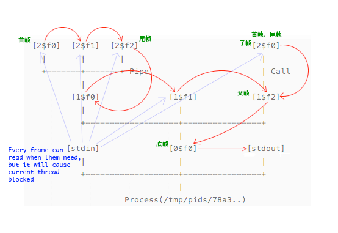

---
title:进程
author:zozoh
tags:
- 系统
- 进程
- 会话
---

# 什么是进程

与普通操作系统不同，在 *walnut* 虽然也有进程的概念，但是操作系统并不会开启一块内存空间。
因为 *walnut* 没有所谓的内存的概念。 它只有持久存储和交换存储的概念。 因此它会为每个进程开启一个交换对象 `/tmp/pids/78a3..`。 

当进程展开执行的时候，它会出现类似下面的树形结构，当然，每个叶子节点都是一个对象。
所有的叶子节点都实际上通过一个逻辑上的线程并行运行。

    [2$f0]  [2$f1]  [2$f2]                       [2$f0]
      |       |       |                            |
      +-------+-------+ Pipe                       | Call
              |                                    |
            [1$f0]              [1$f1]           [1$f2]
              |                   |                |
              +-------------------+----------------+
                                  |
           [stdin]              [0$f0]          [stdout]
              |                   |                |
              +-------------------+----------------+
                                  |
                       Process(/tmp/pids/78a3..)

下面是详细说明:

    Process(/tmp/pids/78a3..)
        [stdin]          # 进程的标准输入对象，使用者向这个文件写入数据，帧内命令可读到
        [0$f0]           # 进程的底帧，每个进程有且只有一个底帧，其内容作为进程标准输出
            [1$f0]       # 因为底帧上构筑了一个管线命令，因此形成了三个子帧
                [2$f0]   # 第一帧被成为首帧，下标为 0
                [2$f1]   # 帧对象从 0 开始，依次排序
                [2$f2]   # 最后一个管线命令帧被成为尾帧，尾帧负责整条管线的最终输出
            [1$f1]       # 帧对象存放的数据随着帧的退出而被清除
            [1$f2]       # 在帧对象中执行其他的命令被成为 "Command Call"
                [2$f0]   # 会导致创建子帧，当然如果 Command Call 是个管线，
                         # 会导致创建一组子帧
        

# 进程的帧

* 进程有且只有一个 *底帧*
    - *底帧* 通常有两种, `wap` 或者 `wsh`
    - *wap* 用来执行应用传来的命令
    - *wsh* 用来执行用户通过终端传来的命令
* *底帧* 没有 *父帧*，只能有子帧
* *子帧* 必然有 *父帧*
* 并行运行的管线命令，每个命令对应一帧
    - 第一个命令对应的帧为 *首帧*
    - 最后一个命令对应的为 *尾帧*
    - 一个 *子帧* 有可能同时即是 *首帧* 又是 *尾帧*
    - *底帧* 必然同时即是 *首帧* 又是 *尾帧*
* 一个帧的有所谓的 *管道输入* 和 *标准输出*。 
    - *管道输入* 可以为帧命令提供可选输入
        + 凡是 *首帧* 就没有 *管道输入*
    - *标准输出* 通常记录到自身对象内，但是有下面几个特例
        + *尾帧*当不是*底帧*的时候，其 *标准输出* 为 *父帧* 对象。

# 逻辑线程

每个帧正在执行的命令是由一个**逻辑线程**负责的，请看下图我标识了 `T` 的地方:

     (T)     (T)     (T)                           (T)
    [2$f0]  [2$f1]  [2$f2]                        [2$f0]
      |       |       |                             |
      +-----(~T)------+ Pipe                        | Call
              |                  (T)                |
            [1$f0]              [1$f1]            [1$f2]
              |                   |                 |
              +-----------------(~T)----------------+
                                  |
           [stdin]              [0$f0]          [stdout]
              |                   |                |
              +-------------------+----------------+
                                  |
                       Process(/tmp/pids/78a3..)

也就是说，如果你执行了一一组管线命令，那么会导致运行当前帧的**逻辑线程**暂停 (`~T`)， 并等待整个管线执行完毕。 所谓 **逻辑线程**，物理上根据实现的不同，可能是一个真正的线程，
也可能是一台虚拟机，甚至有可能是一整个集群。

# 进程对象

    #############################################
    # 关键元数据
    nm     : "78a3.."      # 进程 ID
    tp     : "$p"          # 进程的 Obj.type
    f      : "4fa2.."      # 进程所在的底帧
    fmaxp  : 50            # 管线最大并行帧数
    fmaxd  : 100           # 帧最大高度，底帧高度为 0
    status : "NEW"         # 进程的状态，NEW|ZOMBIE|RUN|DONE
    stdin  : "7921.."      # 标准输入的句柄
    stdout : "8d5a.."      # 标准输出的句柄
    lm     : Date()        # 最后被访问时间
    ow     : "root"        # root 才能改
    seid   : "ae86.."      # 开启进程的会话 ID
    #############################################
    # 对象内容
    ..
    ..  还木想到能干啥用 T_T! ..
    ..

# 帧对象

    #############################################
    # 关键元数据
    nm       : "0$f0"     # 进程内唯一的名称，由 "$depth$tp$index" 构成
    brief    : "wsh xxx"  # 当帧运行时，运行程序给这个帧写入的一些便于阅读的信息 
    tp       : "$f"       # Obj.tp
    pid      : "43cd.."   # 自己的父帧对象 ID
    depth    : 0          # 帧的高度，即它处于树的哪一层，0 为底帧
    index    : 0          # 帧在管线中的序号，0 为首帧
    istf     : false      # 当前帧是否是尾帧
    taili    : -1         # 自己最后一个子帧的下标，-1 表示没有子帧
    pipe     : "a45d.."   # 管线输出的句柄,null 表示没有管线输入
    stdout   : "9f1d.."   # 标准输出的句柄,null 表示空输出
    _PID     : "78a3.."   # 所属进程的 ID
    status   : "NEW"      # 帧的状态，NEW|RUN|DONE
    lm       : Date()     # 最后被访问时间
    ow       : "root"     # root 才能改
    #############################################
    # 对象内容
    xx xx xx xx xx xx xx xx xx
    记录自己的标准输出（当然，尾帧和底帧是木用的)
    后台运行的进程，底帧的输出也是空的
    xx xx xx xx xx xx xx xx xx
    xx xx xx xx xx xx xx xx xx

*帧* 被看做是命令执行的上下文

# 进程的创建-输入输出-退出

     - @io
     - @ps
     - @sess
    //------------------------------------------
    @At("/p/create") $seid, str
    {
        PID = ps.born(seid);
        ps.start(PID, str);
        >> PID >> cookie
    }
    //------------------------------------------
    @At("/p/in/str") $seid, $PID, str
    {
        String cid = ps.getStdin(PID);
        io.write(cid, str+"\n");
        io.flush(cid);
    }
    //------------------------------------------
    // EventSource
    @At("/p/out") $seid, $PID, %ops
    {
        String cid,oid = ps.getStdout(PID)
        while(true){
            if(!exists cid || !exists oid)
                break;
            io.read(cid, ops);
            io.sync().cnd_wait(oid,"flush", 0);
        }
    }
    //------------------------------------------
    @At("/p/quit") $seid, $PID
    {
        ps.kill(PID)
        >> -- PID >> cookie
    }

# 进程de线程管理

# 系统的主程序

## `wsh` 命令执行程序

     - @io
     - @ps
     - @sync
    proc.exec(api, args) {
        List<tokens[]> list 根据 args 中的"|" 拆分成一组符号表
        // 得到当前帧
        pfr = ps.checkFrame(api.currentFrame()) 
        // 为所有的管线命令建立执行帧
        frs[];
        tds[];
        for(i, tokens[] : list) {
            frs[i] = ps.pushFrame(pfr,i,list.size-1)
            tds[i] = ps.createThread(frs[i],tokens)
        }
        
        (tds).START_ALL     // 结束后，会 pop 帧且 cnd_signalAll(pfr.id,"pop")
        do{
            == sync.cnd_wait(pfr.id, "pop", 5000L) ==
        }while (pfr 还有子帧不是 DONE)
        for(fr : frs[]){
            ps.popFrame(fr)
        }
    }

## `wap` 应用进程执行程序

     - @io
     - @ps
     - @sync
    proc.exec(api, args) {
        ! 检查 pfr = ps.checkFrame(api.currentFrame()) 为底帧 (depth==0)
        // 检查且保存应用内命令路径到线程上下文
        appPath=args[0] 通过 io 确保这个路径是一个应用
        appPath >> save to >> T<WnContext> 
        // 建立一个缓冲的输出流 ...
        包裹 ops  {
            - str 的缓冲
            write(byte b[], int off, int len) {
                根据 GCTP1.0 读取命令 -> str
                if(quit)
                    throw quit
                api.exec(str)
            }
        }
        // 开始与输入输出流交互
        String cid,oid = ps.getStdin(PID)
        while(true){
            if(!exists cid || !exists oid)
                break;
            try{
                io.read(cid, ops);    
            }catch(E){
                break;
            }
            io.sync().cnd_wait(oid,"flush", 0);
        }
    }

## `sudo` 超级用户检查

    ... 将权限的票记录到 PID 里面，具体细节再想想 
    

