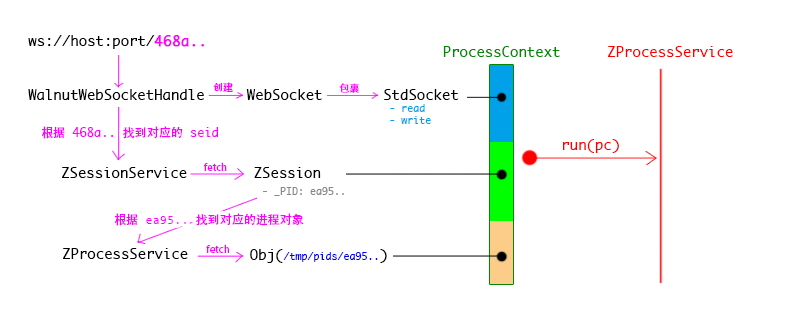
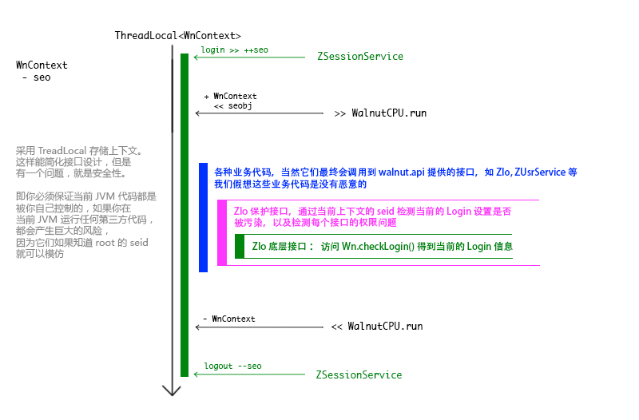

---
title:系统工作机制总览
author:zozoh
---

# 一个进程的工作流程

* 当建立了一个 *WebSocket* 以后，客户端与服务器的通讯则遵循 [命令机制](cmd.md)
* 一个 *apo* 实际上是有一组自己的的命令，并组合上系统的命令来完成业务逻辑的。
    + 因此 *apo* 执行的命令会优先从自己的命令对象集合中查找
    + 如果没有找到才会从当前环境变量 `PATH` 中查找对应的命令

# 进程获取会话信息洋葱图

