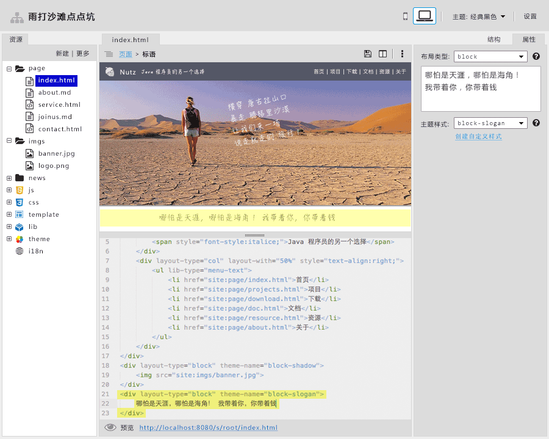

---
title:网站扩展
author:zozoh
tags:
- 扩展
- 网站
---

# 利用 Walnut 维护网站

Walnut 天生就是一个很好的网站后台的模子。我们现在需要添加一点点约定，
让其可以很容易制作和生成网站，无论是静态网站还是动态网站。

这里我们先列出一些观念:

1. 一个网站包括一个配置文件以及一组模板
2. 动态数据来自:
    a. [HTTPAPI](../core/httpapi.md)
    b. 文件或者文件夹
3. 网站工具主要被应用在如下场景:
    a. 博客
    b. 商城
    c. 公司/组织网站
    d. 在线wiki

# 站点的文件结构

一个站点所有的信息都会存放在一个目录下。当然，你可以用链接目录，将其他目录链接至站点目录。

```
%mysite%
    site.conf               # 站点的配置信息，是一个 JSON
    #...................................................................
    .tmp                    # 存放临时数据的隐藏目录。比如切换主题，之前定制的
                            # 的内容会存放 .tmp/blacksky/xxx 下
    #...................................................................
    publish                 # 已经发布的内容，存放在这里
    #...................................................................
    js                      # 站点用到的动态行为，具体请参看 JS 约定
    css                     # 站点用到的样式
    template                # 模板目录
    lib                     # 组件目录
    i18n                    # 国际化语言包目录
    #...................................................................
    theme                   # 主题，详细请看"网站的主题"的介绍
        current -> blacksky     # 当前主题链接至某一个备选主题
        #...........................................................
        blacksky                # 备选主题, 元数据 ptheme 指向自己从什么主题继承
            js                  # 主题用到的 JS 文件
            css                 # 主题用到的样式表
            template            # 主题的模板目录
            lib                 # 主题的组件目录，与模板目录同理
            i18n                # 主题的国际化语言包目录
    #...................................................................
    # 站点的数据目录，通常包括网页，文章，等。 这个目录下，用户可以随意建立子文件夹
    # 并可以用 HTML 或者 Markdown 来书写
    # 后面我们会详细描述这个目录在不同场景下的大概样子
    data
        ..
        ..
```

# 网站设计工具



# 站点配置信息

...

# 模板约定

...

# 主题约定

...

# 数据目录约定

...

# 组件约定

...


