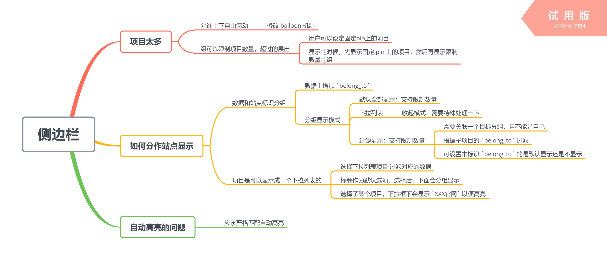

-------------------------------------------------------------
# 概述

根据 `app sidebar` 命令执行的结果，渲染出浏览器的侧边栏

-------------------------------------------------------------
# JSON渲染结果

```js
{
    list : [{
        name  : "data"
        mode  : "normal",
        title : "i18n:xx.xx.xx",
        limit : 3,
        limitCount : "pin",
        folding : true,
        items : [{
            ph     : "/path/to/obj",
            text   : 'xxx',     // 默认的显示文字 obj.title > text > obj.nm
            icon   : '<..>',    // 默认的icon obj.icon > icon > obj.tp ICON
            editor : "thing2",  // 默认使用的编辑器， obj.editor > editor
            pin    : true,
            obj    : {/*一个 WnObj 数据*/}
        }, {/*..*/}]
    }, {
        mode  : "dropdown",
        title : "i18n:xx.xx.xx",
        items : []
    }, {
        mode : "filter",
        title  : "i18n:xx.xx.xx",
        fltKey : "belong_to",
        fltBy  : "0",
        items : [{
            ph     : "/path/to/obj",
            editor : "thing2",
            pin    : true,
            obj    : {/*一个 WnObj 数据*/}
        }, {/*..*/}
    }]
}
```

-------------------------------------------------------------
# HTML渲染结果

`app sidebar -html` 输出的渲染结果为

```html
<!--
普通分组
  mode     组模式，默认 normal，还可以是 dropdown/filtered
  limit    本组可显示的项目最多多少项，超过了，会折叠到 .wn-sb-more 里
  limit-count 表示 limit 限制是否包括 pin，如果值不为 pin 则表示限制除了 pin 以外的项目
  folding  本组是否可折叠，即点击标题，全组隐藏
  nm       标识本组的名称，必须唯一

限制模式下，需要自动把当前高亮的项目加入选择项目，因此绘制显示列表的顺序为
  1. PIN
  2. 当前（如果非 PIN 项目）
  3. 剩余项目
PIN 的项目存放在本地一个数组里，每个项目为ID，可以调整顺序
-->
<section mode="normal"  title="i18n:xx.xx.xx" nm="data"
         limit="3" limit-count="pin" folding="yes">
    <h4><span>i18n:xx.xx.xx</span></h4>
    <ul class="wn-sb-its-show">
        <li class="wn-sb-it"
            ph="/path/to/obj" 
            editor="thing2" 
            oid="vei7j2ci7mgb9qp4c6a9udm30s"
            pin="yes"> <!-- pin 指明当前项目是否是固定的，这个是来自用户本地设置 -->
            <i class="zmdi zmdi-traffic"></i><a>产品</a>
        </li>
    </ul>
    <div class="wn-sb-more">
        <b>更多</b>
        <ul><!--这里是更多的 LI --></ul>
    </div>
</section>
<!--下拉列表-->
<section mode="dropdown" title="i18n:xx.xx.xx">
    <h4><span>i18n:xx.xx.xx</span><b><!--按钮图标--></b></h4>
    <ul class="wn-sb-its-drop"><!--这里是更多的 LI，当点击后展开 --></ul>
    <ul class="wn-sb-its-show">
        <!--这里是更多的 LI -->
    </ul>
</section>
<!--
过滤显示
  flt-key 标识采用对象的哪个字段进行过滤，默认的用 belong_to，值是对象ID
  flt-by  指明用哪个组来过滤。
            0-n 为整数形式，直接指明组下标
            xxx 为组名称，组标签声明了 `nm` 才会生效
          无论哪种形式，如果指向自己，都是无效的
          如果 flt-by 无效，那么组会被当做 normal 模式显示
-->
<section mode="filter" title="i18n:xx.xx.xx" flt-key="belong_to" flt-by="0">
    <h4><span>i18n:xx.xx.xx</span></h4>
    <ul class="wn-sb-its-show">
        <li class="wn-sb-it"
            ph="/home/zozoh/thing/产品" 
            editor="thing2" 
            oid="vei7j2ci7mgb9qp4c6a9udm30s"
            pin="yes"> <!-- pin 指明当前项目是否是固定的 -->
            <i class="zmdi zmdi-traffic"></i><a>产品</a>
        </li>
    </ul>
    <div class="wn-sb-more">
        <b>更多</b>
        <ul><!--
            这里是更多的 LI
            每个里面都有 belong_to 
         --></ul>
    </div>
</section>
```

-------------------------------------------------------------
# 思考过程

