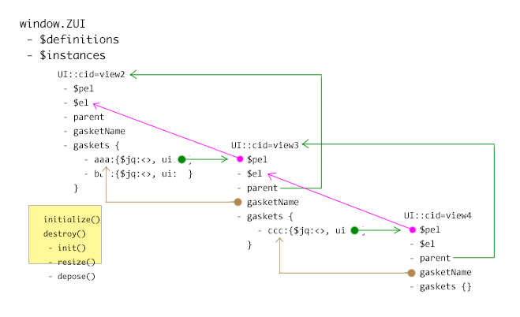

# UI 的本质

一个 UI 就是一个 BackboneView。 通过 new 就能生成它的实例。
new 方法会调用 BackboneView.initialize ， 在这个函数里，
ZUI 框架会调用自己的 init 约定

# UI 实例的数据结构

 Attr      | Type   | 说明
-----------|--------|--------------
$el        | jQuery | UI 的顶级元素
$pel       | jQuery | UI 所在的选区
parent     | UI     | 父UI的实例
gaskets    | Obj    | 当前 UI 的扩展点们
gasketName | Obj    | UI 所在父元素的扩展点
init()     | func   | 初始化函数
resize()   | func   | 调整 UI 内部尺寸
depose()   | func   | 释放 UI 实例的资源

# UI 的全局记录

    window.ZUI        # 全局记录 ZUI
     - $defines       # 记录定义，这样 UI.def 就不会重复定义了
     - $instances     # 记录实例，将 UI 的 cid 作为键
     

# UI 的继承

UI 有两种:

1. 用来继承的
2. 用来构建实例的

没有第三种。 因此用来继承的 UI 则不能被实例化，比如(layout)

