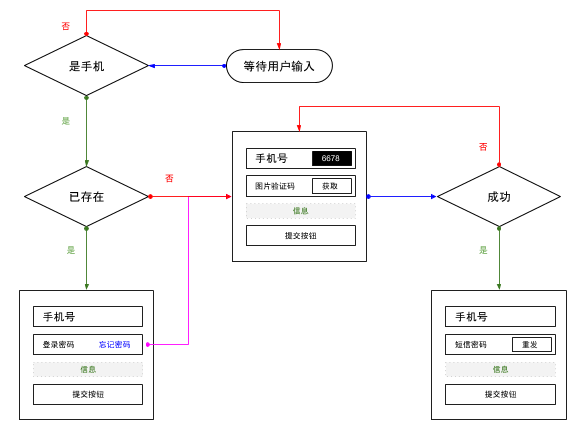

---
title:账号体系
author:zozoh
tags:
- 扩展
- hmaker
---

# 账号体系概述

任何一个网站都有可能需要一个账号体系，本文将详细描述对于一个网站的账号体系解决方案。
首先我们先来界定一下功能边界：

- 账号需要支持微信等 oAuth2 登录
- 账号需要绑定手机号，有时候甚至需要强制绑定手机
- 网站可能会将账号分作多个角色，根据角色不同展现的界面可能也有所不同

因此我们大约给出的解决方案策略是：

- 账号是一个 thing，但是有固定的几个字段（譬如手机，oAuth2 等）
    + 这个 thing_set 必须有元数据 `hm_atype="account"` 
    + 站点的主目录必须有元数据 `hm_account_set="4653q..."` 指定自己站点的账号表
    + 账号的角色字段 `th_role` 如果是数组，则表示该账号有多个角色
- 角色是一个 thing，有固定字段 
    + 字段 `nm` 表示角色的唯一标识名
    + 字段 `th_nm` 则为显示名，可以输入中文
    + 账号表选择角色的时候将跟对应的角色表联动
    + 站点的主目录必须有元数据 `hm_role_set="4653q..."` 指定自己站点的角色表
- 会话是一个目录
    + 它的位置在 `.hmaker/session/站点ID/会话ID` 是一个文件
    + 会话文件的 `id` 就是 `obj.id` 是不变的
    + 会话文件的 `nm` 就是 `obj.nm` 会定期变化，相当于 `access_token` 的作用
    + 会话可以存放了诸如，用户本地语言，时区，一些本地选择等信息，譬如购物车信息
    + 通常会话文件的过期时间为 7 天
    + 如果用户登出一个会话，服务器上也不会删除，下次登录的时候，会把上次会话信息 copy 过来
- `www` 机制将对上述逻辑进行内置支持
    + 发布后的目录，会带上 `hm_account_set | hm_role_set`
    + WWWModuel 上会提供 login 之类的接口，处理相关会话等
- `regapi` 机制将提升安全性 @see 后面章节的描述


# 注册登录流程


## 如何保护页面

在页面中，嵌入：

```
<if test="!API.checkMyPhone()">
    <redirect code="302" text="Found">
        <url>/login.html</url>
        <http-resp-header>
            <Set-Cookie>www=45tr..3we1/er43..23vd; path=/; </Set-Cookie>
        </http-resp-header>
    </redirect>
</if>
```

- `API` 对象是上下文的一个调用接口 `WWWPageAPI`
- `checkMyPhone` 函数将会依次检查是否登录，以及用户是否有手机号
- `<url>` 表示要转移的路径
    + 如果是绝对路径，表示相对于站点的路径
    - 如果是相对路径，表示相对于当前的地址

## 如何记录登录信息

在 Cookie 中记录这样两个值:

```
# 格式为  www=站点ID/会话票据
www=45tr..3we1/er43..23vd
```

每个站点对应的会话，存放的位置在:

```
~/.hmaker/session/站点ID/会话票据
```

- 根据站点和会话的票据可以得到各自的元数据，并且能得到用户的全部元数据
- `checkMyPhone` 会根据这个线索，在上下文创建 `me` 这个键，表示用户的元数据

## 会话元数据

```
{
    id   : "45..8a",    // 会话唯一ID
    nm   : "54..8m",    // 会话的票据，会定期变化
    expi : 159..,       // 过期时间点
    uid  : "u6..8r",    // 会话的用户ID
    unm  : "xxx",       // 用户的名称（冗余）
}
```

## 站点元数据

如果后续接口要做安全验证，必然要传上来 `appId(即 siteId)`，那么我们可以得到站点的元数据

```
{
    // 站点的文件对象类型，必须是 hmaker_site
    tp: "hmaker_site",

    // 指向站点的工程目录
    hm_site_id: "79..r2",

    // 指向了站点对应的账号数据集（ThingSet）
    hm_account_set: "84..2c",

    // 指向了站点对应的角色数据集（ThingSet）
    hm_role_set: "yt..2q",

    // 当访问站点，但是没有指明入口页时，默认跳转到哪个页面，
    // 默认是 index.wnml | index.html
    www_entry: "enter.html",

    // 如果本站点登录后，默认跳转的连接
    // 当然这通常是直接访问登录界面的调整
    // 其他页面跳转到登录页的时候会在 cookie 里指明要调整的目标
    // 如果这个值不设置，将采用 entry 的设置
    hm_login_entry: "index.html",

    // 指向本站点关联的微信公号目录
    hm_wxmp : "gh_xxx",   

    // 下面两个元数据是发布目标和站点皮肤，基本只会和发布有关，在这里我们无视就好
    hm_target_release: "~/www/zozoh.site0.cn/",
    hm_site_skin: "默认",
}
```

# REGAPI 支持

- 如何搞定 API 的安全性
- 应该是 JS 先根据 Session 读取一个站点名称，以及 access token 之类的
- 把 token 传递给 REGAPI，然后 api 加载前，会先验证权限啥的
- 这个应该写在 api 文件的配置元数据里，表示是否要验证权限
- 嗯，细节稍后再想

API 文件支持元数据

```
secur_check : true
```

表示本 API 必须经过安全检查，因此对上传的请求有下面的要求：

1. 必须是 POST，请求体的内容必须是一个 JSON，稍后会给出结构规范
    - @see [请求体的Json结构规范](#请求体的Json结构规范)
2. 请求必须是已经登录的的有效会话
    - @see [如何记录登录信息](#如何记录登录信息)

## 请求的Json结构规范

```
{
    api      : "/thing/update",    // 「必」指明要调用的API路径
    appId    : "45fd..fq8a",       // 「必」指明站点 ID (工程目录)
    ticket   : "69v7..t3a6",       // 「必」指明当前的用户的访问票据
    salt     : "xxx",              // 「必」盐，不长于32位，譬如一个随机的UUID
    time     : "1498..",           // 「必」时间戳
    signType : "MD5",              // 「选」签名类型，支持 MD5|SHA1，默认MD5
    sign     : "xxx",              // 「必」请求签名 @see 签名算法
    data     : {..}                // 「必」是一个 JSON 对象，表示提交的数据
}
```

## 签名算法

```
1. 将请求的键值拿来排序(ASC)，无视 `signType 和 sign`
2. 将这些键对应的值拼接起来，data因为是个JSON，要变字符串（双引号紧凑模式）
3. 执行签名，譬如 MD5
```

- 这个签名算法，保证了 ticket 与提交的 data 是唯一相关的
- 除非你能得到一个用户的 ticket，否则你不可能用TA权限提交数据
- 如果拦截数据包，你得到了一个用户的 ticket，你也不能修改 data 再度提交
- 服务会保证，ticket 每次执行都会变化，并作为 cookie 下发下去

Java 代码例子

```java
// TODO ...
```

在浏览器端，你可以通过给定的帮助函数生成签名并调用 REGAPI：

```
WnApi.invoke({
        api : "/thing/update"
        //...
        //不需要写 sign 字段
        //signType 不指明的话，默认用 MD5
        //不需要写 ticket，因为会自动从 Cookie 里读
        //...
    }, functiton(re) {
        // TODO 这里是 API 的返回，通常是个JSON字符串
        // 自己 $z.fromJson 即可
    });
```

## 账号元数据

那么根据 `hm_account_set`，以及会话中的 `uid`，我们可以得到一个账号的元数据：

```
{
    id : "u6..8r",    // 会话用户的 ID
    nm : "u6..8r",    // 用户的登录名，通常为 id

    //................................ 登录信息
    login : 158..,      // 绝对毫秒数，表示上一次登录
    role  : "user",     // 角色值，即 role.nm
    //................................ 用户信息
    th_nm  : "小白",       // 用户昵称
    thumb  : "id:xxx",    // 头像存储的位置
    city     : "海淀",
    province : "北京", 
    country  : "中国",
    sex      : "male",     // 性别 男:1,女:2

    //................................ 采用密码登录
    passwd : "$SHA1",          // 加盐密码
    salt   : "xxxx",           // 盐值

    //................................ 其他可登录字段
    phone  : "18501211985",           // 手机号码
    email  : "zozoh@nutzam.com",   // 邮箱

    //................................ 采用 oauth 认证
    // 字段以 oauth_ 开头
    oauth_github  : "xxxxxxx",
    oauth_wxlogin : "oSQW..cYq"

    //................................ 采用微信公众号的 openId
    // 键的格式为 wx_公众号ID
    // 值为 OpenID
    wx_gh_xxxx : OpenId
}
```

## 角色元数据

那么根据 `hm_role_set`，以及用户中的 `role`，我们可以得到一个角色的元数据：

```
{
    nm       : "user",        // 角色唯一名
    th_nm    : "小白",         // 角色显示名
    mainpage : "index.wnml",  // 着陆页
    isdft    : true,          // 是否为默认角色，只能有一个有效
}
```

# 内置接口

## 登录

POST 请求 `/www/u/login`：

**账号名密码登录:**

```bash
# POST 参数:
sid : xxx        # 站点 ID
unm : xxx        # 用户登录名
pwd : xxx        # 密码，6位以上数字字母组合
```

**手机短信动态密码:**

```bash
# POST 参数:
sid : xxx        # 站点 ID
unm : 139..      # 手机号
pwd : 6847       # 动态短息密码，4-6位数字
```

# 登录页面推荐操作逻辑




