---
title:hMaker Markdown Poster Template
author:zozoh
tags:
- 扩展
- hmaker
---

# 什么是 Markdown Poster Template

与 Markdown 支持的 <code>```poster</code> 代码，为了能让输入者更加简单，这里给出一些可穷举的布局模板

---------------------------------------------
# 模板例子列表

## `mdp_01`


```bash
@layout:t1
@bg:media/01.jpg
@color:#000
@height:2rem/1.6rem
+text:ALL NEW CHANGE HUROM
+text.big:惠人创新科技
+text.big:简单而不凡
```

## `mdp_02`

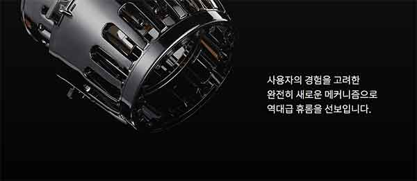

```bash
@layout:t2
@bgcolor:#060606
@color:#D0D0D0
+picture:media/02.jpg
-group
  +text:源于用户体验优化
  +text:全新压榨解决方案
  +text:创新升级无网结构
```

## `mdp_03`

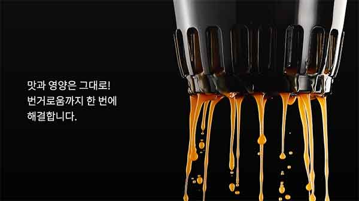

```bash
@layout:t3
@bgcolor:#060606
@color:#D0D0D0
+picture:media/03.jpg
-group
  +text:更美味的营养原汁
  +text:更简单的清洗操作
  +text:一冲即净
```

## `mdp_04`

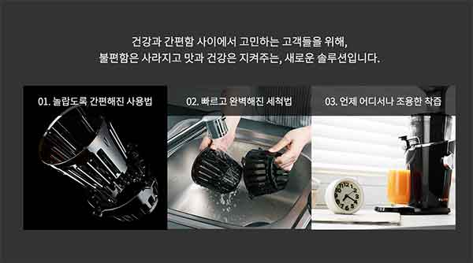

```bash
@layout:t4
@bgcolor:#060606
@color:#D0D0D0
+text:不需要再因为费时费力而犹豫不定
+text:创新科技让你简单拥有健康和美味
-group
  -group
    +text:01.新奇的使用体验
    +picture:media/04-a.jpg
  -group
    +text:02.简单快速的清洗
    +picture:media/04-b.jpg
  -group
    +text:03.不论何处都能安静优雅地榨汁
    +picture:media/04-c.jpg
```

## `mdp_06`


```bash
@layout:t1
@bgcolor:#FFF
@color:#000
@height:2rem/1.6rem
+text.small:Different Hurom
+text.big:生而不同，创造不凡
+text:惠人将大自然的馈赠分享给每一个人
```

## `mdp_07`

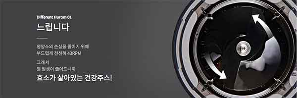

```bash
@layout:t3
@color:#E0E0E0
+picture:media/07.jpg
-group
  +text.small:Different Hurom 01
  +text.big:慢榨
  +text.small:
  +text.small:每秒43转的优雅转速
  +text.small:减少了热量和营养流失
  +text.bold:温和地保留了大自然的馈赠
```

## `mdp_08`


```bash
@layout:t2
@color:#444
+picture:media/08.jpg
-group
  +text.small:Different Hurom 02
  +text.big:无刀
  +text.small:
  +text.small:没有刀片，慢速挤压
  +text.small:减少氧化和果蔬伤害
  +text.bold:天然色彩，自然美味
```

## `mdp_09`

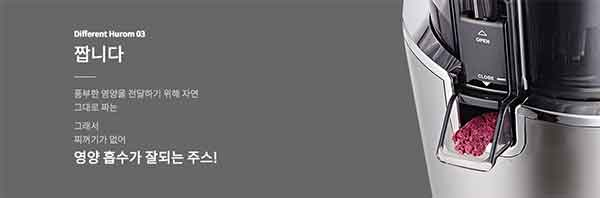

```bash
@layout:t3
@color:#E0E0E0
+picture:media/09.jpg
-group
  +text.small:Different Hurom 03
  +text.big:美味
  +text.small:
  +text.small:无需加水，没有添加剂和色素
  +text.small:纯粹的顺滑果汁
  +text.bold:美味难以抵挡
```

## `mdp_10`


```bash
@layout:t5
@bgcolor:#444
+text.small:为什么选择Hurom惠人？
+text.large:简单，美味，健康。
+text.large:照顾自己和家人，
+text:从新的惠人原汁榨汁机开始。
-group
  -group
    +picture:media/10-a.jpg
  -group
    +picture:media/10-b.jpg
  -group
    +picture:media/10-c.jpg
```

## `mdp_11`

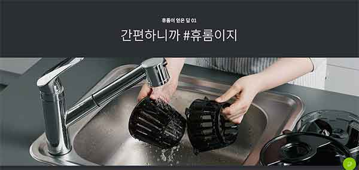

```bash
@layout:t1
@bgcolor:#444
@color:#EEE
+text.small:惠人的魅力01
+text.large:简单
+picture:media/11.jpg
```

## `mdp_12`

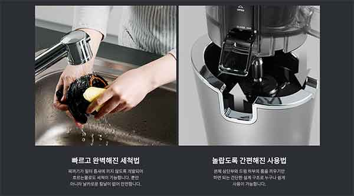

```bash
@layout:t6
@bgcolor:#444
@color:#EEE
-group
  -group
    +picture:media/12-a.jpg
    +text.big:简单快速地清洗
    +text.small:升级核心组件，不再残留果渣，清水就可以简单完成冲洗
    +text.small:没有刀片的结构，清洗更加安全
  -group
    +picture:media/12-b.jpg
    +text.big:一步到位完成组装
    +text.small:简单明了的组装引导槽
    +text.small:让所有部件的安装一目了然
```

## `mdp_14`

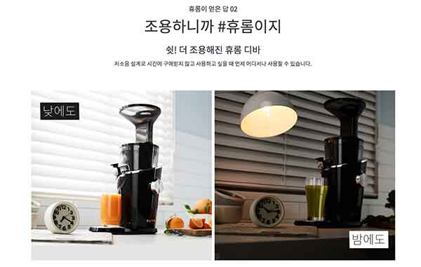

```bash
@layout:t6
@bgcolor:#FFF
+text.small:惠人的魅力02
+text.large:安静
+text.bold:嘘！ 它其实已经在工作了
+text.small:更低噪音设计让榨汁随时随地保持静谧悠雅
+text.big:
-group
  -group
    +picture:media/14-a.jpg
  -group
    +picture:media/14-b.jpg
```

## `mdp_15`

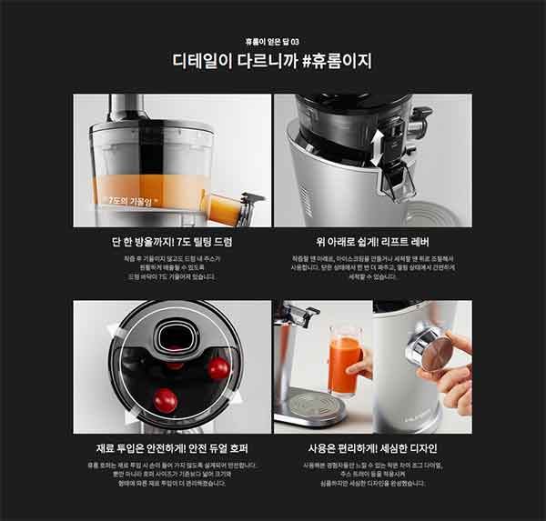

```bash
@layout:t7
@bgcolor:#1c1d1d
@color:#EEE
+text.small:惠人的魅力03
+text.big:细节
-group
    -group
      +picture:media/15-a.jpg
      +text.bold:独特7°倾斜前体
      +text.small:果汁不再残留
      +text.small:品尝每一滴自然美味！
    -group
      +picture:media/15-b.jpg
      +text.bold:更方便的调节阀
      +text.small:调节阀可以调整前体内的压力
      +text.small:更好地适应不同硬度的食材
      +text.small:推高调节阀，还可让前体更加容易清洗。
    -group
      +picture:media/15-c.jpg
      +text.bold:升级型双投料口
      +text.small:投料口加宽，倾斜度更佳
      +text.small:轻松投入不同食材
    -group
      +picture:media/15-d.jpg
      +text.bold:追求细节的设计
      +text.small:我们改进了果汁托盘、操作转盘等细节的设计
      +text.small:只为不断追求更好的使用体验
```

## `mdp_20`

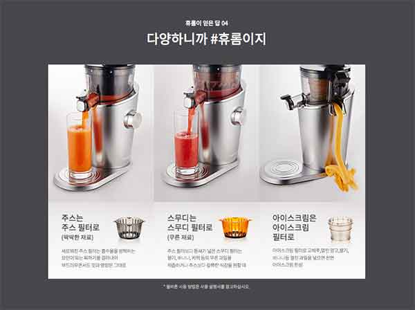

```bash
@layout:t8
@bgcolor:#444
@color:#EEE
+text.small:惠人的魅力04
+text.big:多样化
-group.main-list
  -group
    +picture:media/20-a.jpg
    -group.it-title
        +text.big:纯果汁组件
        +picture:media/20-a-s.png
    +text.small:过滤掉更多阻碍吸收的固体物质，果汁口感更加纯粹顺滑
  -group
    +picture:media/20-b.jpg
    -group.it-title
        +text.big:果粒果汁组件
        +picture:media/20-b-s.png
    +text.small:过滤间隙更宽，保留部分果粒和固体纤维，更适合压榨软性的草莓、香蕉、猕猴桃等水果
  -group
    +picture:media/20-c.jpg
    -group.it-title
        +text.big:冰淇淋组件
        +picture:media/20-c-s.png
    +text.small:更换冰淇淋组件后，关闭出汁口，放入冷冻的水果如芒果、草莓等，直接制作水果冰淇淋，还可加入牛奶或酸奶
+text.small:*请参阅说明书及食谱了解详细使用方法
```

## `mdp_25`

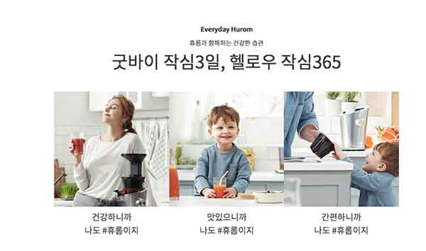

```bash
@layout:t6
@bgcolor:#FFF
@color:#444
+text.small:Everyday Hurom
+text.big:与惠人一起开启健康美味新生活
-group.m2
    -group
      +picture:media/25-a.jpg
      +text.big:健康如我
    -group
      +picture:media/25-b.jpg
      +text.big:美味如我
    -group
      +picture:media/25-c.jpg
      +text.big:简单如我
```

## `mdp_27`

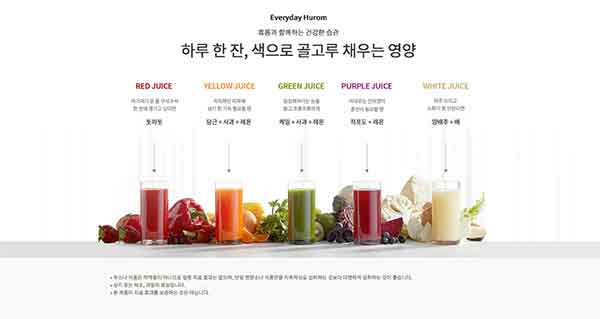

```bash
@layout:t1
+text.small:Everyday Hurom
+text.big:与惠人一起乐享色彩斑斓的美味营养
+picture:media/27.jpg
+list
 - :果汁不是药物，不能治愈疾病，保持食用多于一种营养素或食物对身体更好。
 - :上图是蔬菜和水果的功效。
 - :本产品不承诺任何治疗效果。
```

## `mdp_29`

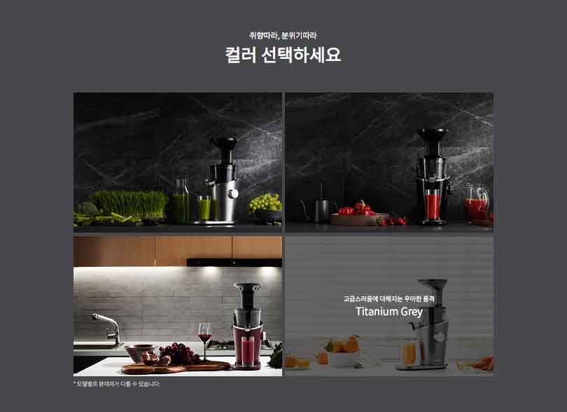

和原来不同！！！就是三张图并排就好

```bash
@layout:t6
@bgcolor:#444
@color:#EEE
+text.big:超凡魅力，低调优雅
+text.small:精致高雅的气息结合现代设计感，追求品味的惠人原汁榨汁机不仅仅是一台电器，更是您对生活品质的一份声明
-group.m2
  -group
    +picture:media/29-a.jpg
  -group
    +picture:media/29-b.jpg
  -group
    +picture:media/29-c.jpg
```

## `mdp_30`

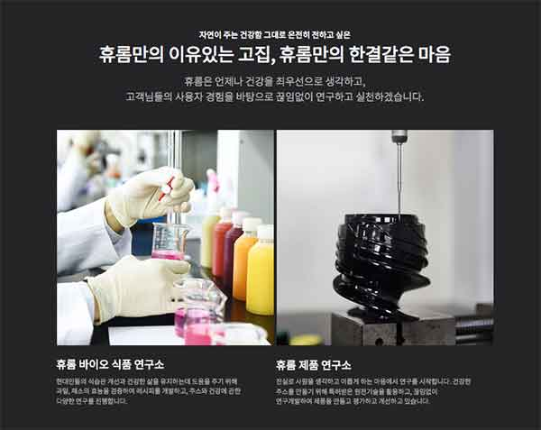

```bash
@layout:t7
@bgcolor:#444
@color:#EEE
+text.small:我们想传达自然健康的美好
+text.large:惠人固执的坚持，不变的初心
+text.small:我们始终将健康视为重中之重，
+text:根据用户体验，不断研究和实践。
-group.m2
  -group
    +picture:media/30-a.jpg
    +text.bold:惠人生物食品研究所
    +text.small:为了改善现代人的饮食习惯，帮助人们维持健康的生活，惠人对水果和蔬菜进行了功效测试，制定了食谱，并坚持进行各种果汁和健康的研究。
  -group
    +picture:media/30-b.jpg
    +text.bold:惠人产品实验室
    +text.small:坚持不懈地从事产品研究工作。 我们利用专利原创技术制造健康果汁，并不断研发创新，评估和改进我们的产品。
```


