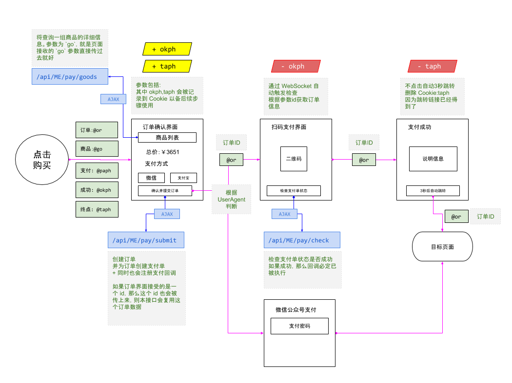

# 支付总体流程



# 站点元数据

```
{
    ...

    // 指向了站点对应的订单数据集（ThingSet）
    hm_order_set: "84..2c",

    ..
}
```

-----------------------------------------------
# 订单元数据

```bash
id    : ID         # 订单唯一ID
th_nm : "xxx"      # 订单名称，通常格式为 `什么时候_谁_购买什么`
price : 2300       # 订单所有商品原始价格汇总
fee   : 2300       # 订单所有商品真实支付金额汇总
cur   : "RMB"      # 货币，默认是 RMB
#---------------------------------------------
# 购买者信息
uid : ID        # 购买者 ID （在站点账号表里）
unm : "xxx"     # 「冗余」购买者昵称
#---------------------------------------------
# 商品信息
# 这里要求所有的商品的 cur （货币单位）必须是一致的，否则会导致结算汇率问题
goods : [{
        id    : ID         # 商品唯一ID
        th_nm : "xxx"      # 商品的名称
        price : 2300       # 原始价格
        fee   : 2300       # 真实支付的价格（通常是折扣后的价格）
        cur   : "RMB"      # 货币，默认是 RMB
    }]
#---------------------------------------------
# 支付信息
pay_id : ID           # 支付单 ID
pay_st : 'NEW'        # 支付状态：NEW | OK | FAIL
# 支付类型决定了系统将采用哪种流程
#  - wx.qrcode  : 微信主动扫二维码付款
#  - wx.jsapi   : 微信公众号内支付
#  - wx.scan    : 微信被物理码枪扫付款码支付
#  - zfb.qrcode : 支付宝主动扫二维码付款
#  - zfb.scan   : 支付宝被物理码枪扫付款码支付
pay_tp : 'wx.qrcode' 
#---------------------------------------------
# 时间
ct : AMS        # 创建时间
lm : AMS        # 最后被修改时间
#---------------------------------------------
# TODO 后续可以增加折扣项列表，以便在界面上可以详细列出
# 对于原始价格的逐个优惠条件
```

-----------------------------------------------
# 商品元数据

商品会被订单系统直接按照 ID 来访问，因此可以散落在多个 ThingSet 里，甚至是一个普通的`WnObj`。
但是无论怎样，它要具备如下信息，才能被当做商品正常被使用:

```
id    : ID         # 商品唯一ID
th_nm : "xxx"      # 商品的名称
price : 2300       # 原始价格
fee   : 2300       # 真实支付的价格（通常是折扣后的价格）
cur   : "RMB"      # 货币，默认是 RMB

# 另外推荐下面的字段
brief : "xxx"      # 商品简单描述
```

-----------------------------------------------
# 跳转逻辑

支付流程由下面几个实体构成：

- `页:订单确认`
- `页:扫码支付`
- `页:支付成功`
- `接口:/pay/submit`
- `接口:/pay/check`
- `接口:/pay/goods`

所有的`页`都是不确定的，因此需要`订单确认页面`接收四个参数:

- `paph` : 支付页是什么路径？*需要绝对路径，即`${URI_BASE}`*
    + 默认为 `${URI_BASE}/payit.wnml`
- `okph` : 确认页是什么路径？*需要绝对路径，即`${URI_BASE}`*
    + 默认为 `${URI_BASE}/payok.wnml` 
- `taph` : 跳出页是什么路径？*需要绝对路径，即`${URI_BASE}`*
    + 默认为 `${URI_BASE}` 
- `go` : 购买什么样的商品
    + 格式为: `商品ID:数量,商品ID:数量`
    + 例如: `45gr..23:1,7gf9..rt1a:1`
    + 这个值直接发送到 `/pay/goods?go=xxx` 里面就可以得到商品详情


-----------------------------------------------
# 关于购物车

本流程，兼容购物车的设计。因为购物车通常是在用户的 cookies 存放一组商品和数量。
如果你提供了购物车页面，在页面的提交部分，直接把购物车里面的值，提交到 `订单确认页` 即可。

-----------------------------------------------
# 关于三个接口

- `接口:/pay/submit` : `/ROOT/jsbin/www_pay_submit.js`
- `接口:/pay/check`  : `命令 pay check`
- `接口:/pay/goods`  : `/ROOT/jsbin/www_goods.js`

也可以看 `site库:/ROOT/site0/etc/init/payment/_files` 里面有创建这些支付接口的细节脚本

-----------------------------------------------
# 关于三个页面

- `页:订单确认` : `site0库:/ROOT/site0/www/example/order_show.wnml`
- `页:扫码支付` : `site0库:/ROOT/site0/www/example/pay_scan.wnml`
- `页:支付成功` : `site0库:/ROOT/site0/www/example/pay_ok.wnml`


