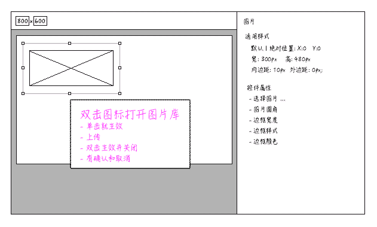

---
title:组件:单张图片
author:zozoh
tags:
- 扩展
- 网站
---


# 概述




# DOM 结构

```
...
<div class="hmc-main">
    
</div>
```

* 转换的时候，应该根据 *src* 的里面的 *ID* 变成路径
* 所有的包裹层都去掉，只留 `` 标签， 内外边距合并为 `margin`;


# 控件属性

## borderRadius : 图片圆角

属性:

```
borderRadius: 4
```

编辑时生成 *CSS* :

```
#(控件ID) img{
    border-radius : 4px;
}
```

渲染时生成 *CSS* :

```
#(控件ID) {
    border-radius : 4px;
}
```

