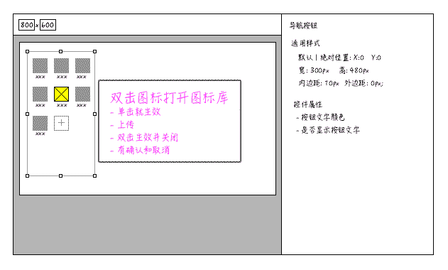

---
title:组件:导航按钮
author:zozoh
tags:
- 扩展
- 网站
---


# 概述




# DOM 结构

```
<div class="hm-com hmc-navbtns" ctype="navbtns" id="navbtns0">
    <script type="text/x-template" class="hmc-prop">...</script>
    <div class="hmc-assist">...</div>
    <div class="hmc-wrapper">
        <div class="hmc-nbi hmc-nbi-actived">
            <div class="hmc-nbi-pic">
                
            </div>
            <div class="hmc-nbi-txt">xxx</div>
        </div>
        <div class="hmc-nbi">...</div>
        <div class="hmc-add-nbi">
            <i class="fa fa-plus"></i>
        </div>
    </div>
</div>
```

# 编辑区行为

1. 点击 *.hmc-nbi-pic* 将弹出图标选择框，修改 `` 的 *src* 属性
2. 选择框可以上传和删除图标
3. 点击 *.hmc-add-nbi* 弹出图标选择框，插入新的按钮，文字是 *"新按钮"*
4. 点击 *.hmc-nbi-txt* 编辑按钮文字

# 控件属性

## color : 图标文字颜色

属性:

```
color: "#FFF"
```

编辑 & 渲染时生成 *CSS* :

```
#(控件ID) {
    color : #FFF;
}
```
## showBtnText : 是否显示图标文字

属性:

```
showBtnText : false        // 默认 true
```

编辑 & 渲染时生成 *CSS* :

```
#(控件ID) .hmc-nbi-txt{
    display: none;
}
```

## btnWidth : 按钮的宽度

属性:

```
btnWidth : 64
```

编辑 & 渲染时生成 *CSS* :

```
#(控件ID) .hmc-nbi{
    width : 64px;
}
```

## btnHeight : 按钮的高度

属性:

```
btnHeight : 64
```

编辑 & 渲染时生成 *CSS* :

```
#(控件ID) .hmc-nbi{
    height : 64px;
}
```


