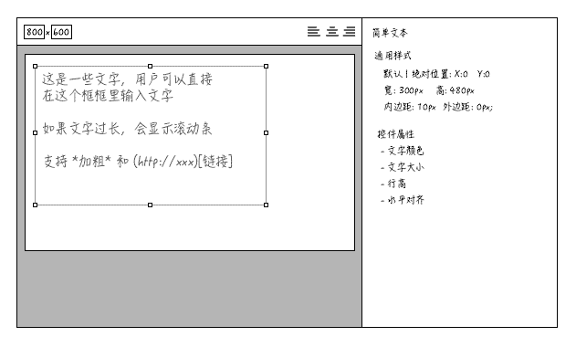

---
title:组件:简单文本
author:zozoh
tags:
- 扩展
- 网站
---


# 概述




# DOM 结构

```
<div class="hm-com hmc-text" ctype="text" id="text1">
    <script type="text/x-template" class="hmc-prop">...</script>
    <div class="hmc-wrapper">
        <div class="hmc-assist">...</div>
        <div class="hmc-main">
            <textarea></textarea>
        </div>
    </div>
</div>
```

# 编辑区行为

在 textarea 里随便写咯

# 控件属性

## color : 文字颜色

属性:

```
color: "#FFF"
```

编辑时生成 *CSS* :

```
#(控件ID) textarea{
    color : #FFF;
}
```

渲染时生成 *CSS* :

```
#(控件ID) {
    color : #FFF;
}
```

## fontSize : 文字大小

属性:

```
fontSize : "14px"
```

编辑时生成 *CSS* :

```
#(控件ID) textarea{
    font-size : 14px;
}
```

渲染时生成 *CSS* :

```
#(控件ID) {
    font-size : 14px;
}
```

## lineHeight : 行高

属性:

```
lineHeight : "20px"
```

编辑时生成 *CSS* :

```
#(控件ID) textarea{
    line-height : 20px;
}
```

渲染时生成 *CSS* :

```
#(控件ID) {
    line-height : 20px;
}
```

## textAlign : 水平对齐

属性:

```
textAlign : "left"
```

编辑时生成 *CSS* :

```
#(控件ID) textarea{
    text-align :"left";
}
```

渲染时生成 *CSS* :

```
#(控件ID) {
    text-align :"left";
}
```

