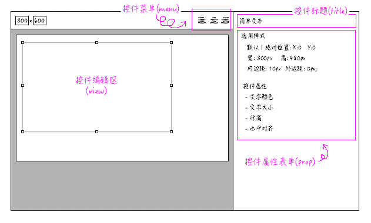

---
title:组件概述
author:zozoh
tags:
- 扩展
- 网站
---

# 什么是编辑器组件

hmaker 对一个页面具体的编辑是是由它内置的一个个控件来完成的



编辑器规划出四个区域交由控件的实现来控制:

1. 控件的菜单(menu): 对于控件编辑区执行的命令
2. 控件编辑区(view): 控件在编辑区所见即所得的部分
3. 控件的标题(title): 控件的标题区，可以显示控件的:
    - 名称 (text)
    - 图标 (icon)
    - 帮助 (help)
4. 控件的属性(prop): 提供一个表单项，修改对应的编辑区

# 编辑器的内存逻辑结构

编辑器控件是一个UI
具体来说，是这么创建的

```
// 之前激活控件释放
AC.destroy();

// 创建新控件实例
AC = new HmakerComponent({
    menu : $menu        // 菜单的 $pel
    title : $title      // 标题区的 $pel
    prop : $prop        // 属性区的 $pel
    
    // 编辑区内某控件的 DOM，控件将直接利用它的数据结构
    $el : $component
    
    // 或者如果是新创建组件，那么就创建一个 $el
    // $pel 是编辑区的 DOM
    $pel : $view
    
    // 传入一个 form 的配置项，配置了通用样式相关字段
    // 控件可以根据自身，添加更多的字段的分组
    propConf : [{
        text : "i18n:hmaker.prop_general",
        fields : [ .. ]
    }]
});
```

当 AC 的 render 完成后，你可以用下面的方式快速访问四个 UI 对象

```
AC              -> 控件本身
AC.gasket.menu  -> MenuUI : "ui/menu/menu"
AC.gasket.title -> DomUI  : "ui/support/dom"
AC.gasket.prop  -> FormUI : "ui/form/form"
```

# 控件的 DOM 结构

控件利用 DOM， 组件来保存自身的属性:

```
<!--
id 属性是必要的，每次控件新建实例，会自动分配。 无论渲染还是编辑时，
会生成 <style> 节点， 每个控件的实例都对应一个 <style> 节点。
用 <style c-id="控件ID"> 来形成对应关系

下面是控件顶级元素支持的属性:

// 自动分配的控件 ID
id    : xxx

// 控件的类型
ctype : text|image|navbtns ...

// 用来标识控件在不同位置体系下的样式
// 具体参看本文后面 position 属性的概述
// 这个属性由编辑器根据 prop， 每次初始化的时候生成
pos : "relative|absolute"

// 标识控件是否正在被编辑
actived : "yes"
-->
<div class="hmc-com" ctype="控件类型" id="控件ID" pos="relative">
    <!--
    这个节点存放 DOM 所有的属性，就是一段 JSON 文本
    ! 渲染时会被移除
    -->
    <script type="text/x-template" class="hmc-prop">
    {
        position : "absolute",
        top      : 100,
        left     : 400,
        ...
    }
    </script>
    
    <!--
    这个节点包裹了显示层面的元素
    -->
    <div class="hmc-wrapper">
        <!--
        这个节点存放 DOM 的辅助节点，比如缩放控制手柄等
        ! 渲染时会被移除
        -->
        <div class="hcm-assist">
            <div class="hcm-pos-hdl" h-type="NW"></div>
            <div class="hcm-pos-hdl" h-type="NE"></div>
            <div class="hcm-pos-hdl" h-type="SW"></div>
            <div class="hcm-pos-hdl" h-type="SE"></div>
            <div class="hcm-pos-hdl" h-type="N"></div>
            <div class="hcm-pos-hdl" h-type="S"></div>
            <div class="hcm-pos-hdl" h-type="E"></div>
            <div class="hcm-pos-hdl" h-type="W"></div>
        </div>
        
        <!--
        剩下的就是控件的主要 DOM 结构。   
        -->
        <div class="hmc-main">
            <!-- 这里面的内容，会在控件的 redraw 函数进行绘制 -->
        </div>
    </div>
</div>
```

# 控件的通用属性

## position : 位置

属性:

```
position: "relative | absolute"
```

* *relative* 表示不是绝对位置(默认)
* *absolute* 表示是绝对位置

编辑 & 渲染时生成 *CSS* :

```
#(控件ID) {
    position : relative;
}
```

## left : X 轴位置

属性:

```
left: 16
```

编辑 & 渲染时生成 *CSS* :

```
#(控件ID) {
    left : 16px;;
}
```

## top : Y 轴位置

属性:

```
top: 16
```

编辑 & 渲染时生成 *CSS* :

```
#(控件ID) {
    top : 16px;;
}
```

## width : 宽度

属性:

```
width: 400
```

编辑 & 渲染时生成 *CSS* :

```
#(控件ID) {
    width : 400px;
}
```

## height : 高度

属性:

```
height: 400
```

编辑 & 渲染时生成 *CSS* :

```
#(控件ID) {
    height : 400px;
}
```

## padding : 内边距

属性:

```
padding: 10
```

编辑 & 渲染时生成 *CSS* :

```
#(控件ID) .hmc-wrapper{
    padding : 10px;
}
```

## margin : 外边距

属性:

```
margin: 10
```

编辑 & 渲染时生成 *CSS* :

```
#(控件ID) {
    padding : 10px;
}
```

# 控件的属性更新流程

```
COM  : 控件
PG   : 页面全局 UI
PROP : 控件属性表单 
.........................................
# 属性变动 (on_change) 会交给控件处理
PROP -> COM.setProperty(key,val)

# 全局UI的帮助函数将获取组件的信息
COM -> PG.getComponentInfo(jCom);
: info

# val 为 undefined 表示删除
# 否则当做修改
COM -> COM

# 保存到 DOM 节点
COM -> PG.setComponentInfo(jCom, info);
: info

# 将更新过的属性，重新设回到属性面板里
COM -> PROP.setData(info);

# 更新自己的样式
COM -> COM.updateStyle(info);

# 全部完成
:
```


