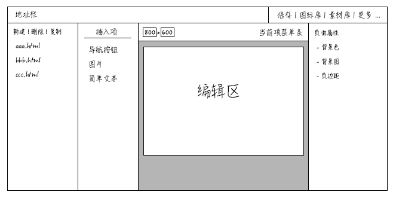

---
title:网站编辑器
author:zozoh
tags:
- 扩展
- 网站
---

# 概述

本应用就是在一个文件夹下制作静态网页，静态网页组件包括:

* 导航按钮
* 简单图片
* 简单文本框

# 项目目录结构

```
%随便一个目录都可以是工程目录%
icon            # 图标目录
image           # 图片素材目录
index.html
abc.html
xyz.html
```

* 工程目录通过命令 `hmaker publish [src dir] [dest dir]` 生成到输出目录
* 说是生成，实际上就是 copy 咯，除非以后有更复杂的诉求

```
%随便一个目录都可以是输出目录%
icons            # 图标目录
images           # 图片素材目录
index.html
abc.html
xyz.html
```

* 通常输出目录有 `www` 属性，因此可以直接被访问

# hmaker 编辑器



# 编辑器组件列表

编辑器可以根据配置支持多种组件，支持的组件定义在 `~/.hmaker/components.html` 里面

```
<section class="hmaker-components">
    <!-- H4 是可以没有的，如果有，就是分组的名称 -->
    <h4>i18n:group.name</h4>
    <ul>
        <li ctype="navbtns">
            <i class="fa fa-th"></i>
            <span>i18n:hmaker.com.navbtns.nm</span>
        </li>
        <li ctype="text">
            <i class="fa fa-text-width"></i>
            <span>i18n:hmaker.com.text.nm</span>
        </li>
        <li ctype="image">
            <i class="fa fa-image"></i>
            <span>i18n:hmaker.com.image.nm</span>
        </li>
    </ul>
    <!--
    下一坨组件
    -->
    <ul> .. </ul>
</section>
```


# 更多内容

* [组件概述](hmaker_component.md)
* [组件:导航按钮](hmaker_com_navbtns.md)
* [组件:简单文本](hmaker_com_text.md)
* [组件:单张图片](hmaker_com_image.md)


