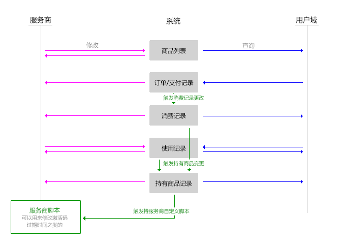

---
title:支付和账户余额
author:zozoh
tags:
- 系统
- 支付
---

# 什么是支付

系统为所有的应用和域提供了支付能力。它假想的逻辑是这样的:

1. 任何域都可提供商品
2. 任何用户都可以购买商品
3. 购买的行为会被系统记录




# 商品

## 数据结构

```
id    : ID               # 商品的 ID 唯一标识
nm    : ${g_ow}_${g_nm}  # 商品文件名永远是这个形式
tp    : "goods"          # 类型一定是  goods
race  : "FILE"           # 一定是文件
thumb : ID               # 商品缩略图
//...........................................
w_th_id : ID             # 商品所对应的 thing ID，可以得到更详细的介绍
//...........................................
w_ow  : DomainName       # 提供商域名
w_nm  : "xxxxx"          # 商品在提供商内部的唯一标识名
w_tt  : "xxxx"           # 商品的标题，支持 i18n:xxx 格式
//...........................................
// 商品的截止期(绝对毫秒数)，超过了这个期限，将不能被购买
w_expi : AMS
w_ava  : AMS             # 商品的生效时间，0 表示立即生效,-1 表示无效 
//...........................................
w_price    : 34.50       # 商品价格，单位元
w_currency : "RMB"       # 货币单位，默认 RMB
//...........................................
w_pay_delay : 24         # 下单后，支付延迟（小时），默认 24
//...........................................
w_nb    : 10000          # 商品数量，0 表示无限
w_count : 35             # 已经出售商品数
w_remain: 7023           # 剩余商品数，0 表示无限
```

## 操作:列出商品

```
# 列出本域所有商品
goods get

# 列出本域某商品详情
goods get $w_nm

# 列出某商品详情同时展开对应的 thing 描述
goods get $w_nm -thing

# 根据 ID 列出某商品
goods get id:xxx [-thing]
```

## 操作:添加或修改商品

```
# 添加商品
goods add JSON

# 修改商品
# ! 已有消费记录的商品不能修改 w_price|w_currency|w_count|w_nm|w_tt
# ! 当修改了 w_nb 的时候，也会同时更新 w_remain
# ! 直接修改 w_remain 会被无视 
goods update $w_nm JSON

# 删除商品(已有消费记录的商品不能删除) 
goods remove $w_nm
```

## 操作:管理与特殊参数 

```
# 列出指定域的商品（必须具备 op 或者 root 组成员权限)
goods get -provider nutz
```

# 订单和支付记录


