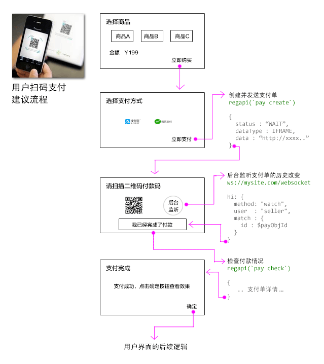

---
title:支付界面制作建议
author:zozoh
tags:
- 系统
- 支付
---

# 主动扫码二维码付款

适用类型:

- `zfb.qrcode`
- `wx.qrcode`




# 商户码枪扫码流程

适用类型:

- `zfb.scan`
- `wx.scan`


## 创建并发送支付单

创建支付单的逻辑，通常是封装在了一个 `regapi` 里。通常用 `jsc` 来执行的一个脚本。
主要是使用系统命令 `pay create` 来执行创建和发送，

这里有一个例子:

```
//........................................
// 声明一些用到的变量
var bu = (bu || "").trim();   // 购买的用户
var go = (go || "").trim();   // 商品
var pt = (pt || "").trim();   // 支付类型
var ta = (ta || "").trim();   // 支付目标（即商户）
//........................................
function _main(params){
    // 买家为空
    if(!params.buyer){
        sys.exec("ajaxre -qe 买家为空");
        return;
    }
    // 商品为空
    if(!params.goods){
        sys.exec("ajaxre -qe 商品为空");
        return;
    }
    // 支付方式为空
    if(!params.payType){
        sys.exec("ajaxre -qe 支付方式为空");
        return;
    }
    // 支付目标商户为空
    if(!params.payTarget){
        sys.exec("ajaxre -qe 支付目标商户为空");
        return;
    }

    // 查询商品以及其价格
    var re = sys.exec2f("obj ~/.goods/%s -cqn'", params.goods);
    if(/^e./.test(re)){
        sys.exec("ajaxre -qs", re);
        return;
    }
    var goo = JSON.parse(re);

    // 商品必须有价格
    if(!goo.fee || goo.fee < 0) {
        sys.execf("ajaxre -qe '商品必须有价格 : %s'", goo.nm);
        return;
    }

    // 准备提交支付单
    // !! 这里的 -callback my_callback 稍后会详细说明，是用来支付成功后进行后续处理的
    var cmdText = "pay create -br '%s' -bu '%s' -fee %s -pt %s -ta %s ";
        cmdText += " -callback my_callback -meta '%s'";
    re = sys.exec2f(cmdText, goo.brief, params.buyer, goo.fee, 
                    params.payType, params.payTarget,
                    JSON.stringify({
                        buy_for    : goo.nm,
                    }));
    
    // 输出成功内容
    sys.exec("ajaxre -q", re);
}
//........................................
// 执行
_main({
    buyer     : bu,
    goods     : go,
    payType   : pt,
    payTarget : ta,
});
//........................................
```

## 支付单的成功回调

通常，如果支付完成了，你总希望执行一些后续操作，
因此，创建支付单的时候，支持一个参数 `-callback my_callback`

你可以随意声明一个回调，所谓回调，是在商户域里的一个命令脚本文件

```
~/.payment/callback/my_callback
```

- `~/.payment/callback` 这个路径是固定的
- 脚本文件就是一行行的命令
- 这个回调一旦执行，支付单会被加入 `apply_at:1456...` 这样的元数据表示回调执行时间，以防止重复执行
- 脚本是一个命令模板，支持的元数据就是支付单的元数据，比如 `${id}` 就是支付单的ID

## 检查付款状况

## 利用 WebSocket 监听支付单改动


# 微信公众号内支付(wx.jsapi)

```
还未实现...
```


