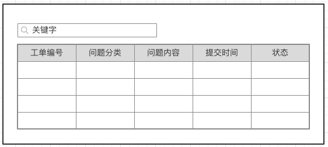
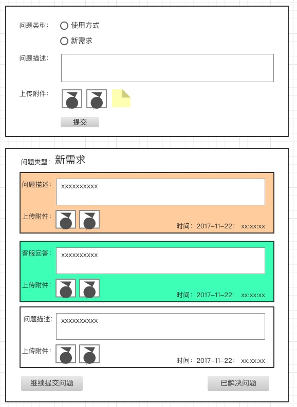
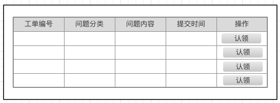
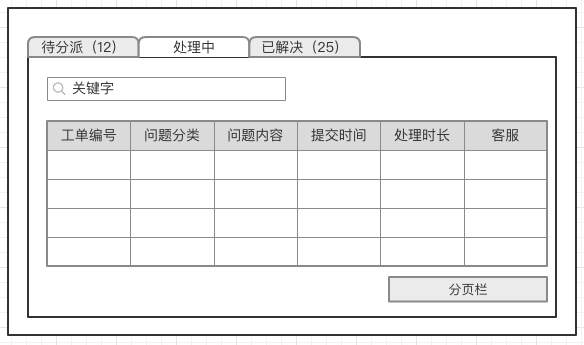
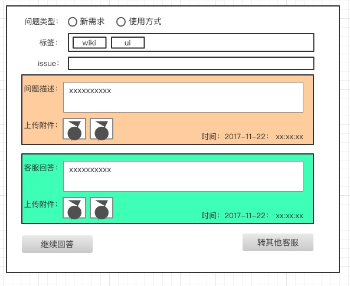

# UI分类

主要分为用户使用与客服使用两种类型

用户使用因为渠道众多，所以需要提供API来完成工单的提交，具体的UI各终端自行完成

## 用户UI

### web表单

需要的内容：

1. 个人的工单列表

2. 工单提交与回馈表单

### 其他

待定

## 客服UI

### web界面

首先需要一个工单认领界面，防止相关问题被指派到某人但却没有看到以致超时。

认领后的工单会加入到自己的工单待处理列表中，其他人暂时无法处理，只有认领人可以转移给其他客服。

1. 认领工单UI

2. 根据工单状态进行分类查询UI

3. 处理工单UI

### 手机网页

主要用于客服快速响应，通过通知发送的链接直接进入回复页面进行响应操作。

因为推送消息会直接带着工单内容，所以可以直接通过链接打开一个 认领+回复 的表单进行处理。

1. 工单查看+回复UI

2. 继续hui'fu

