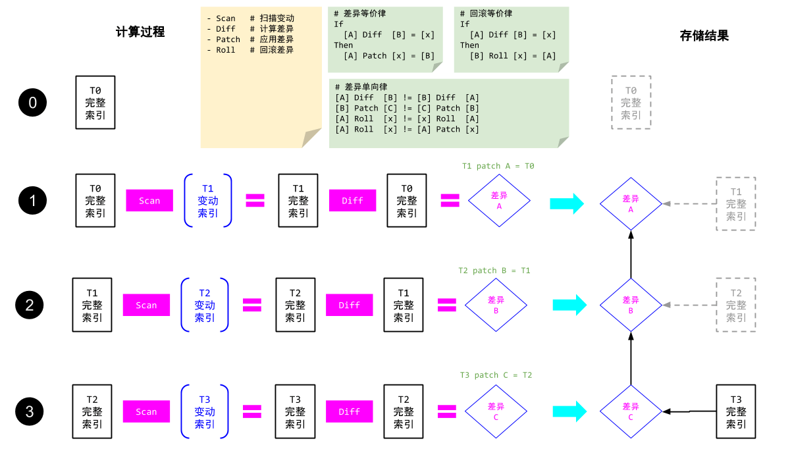
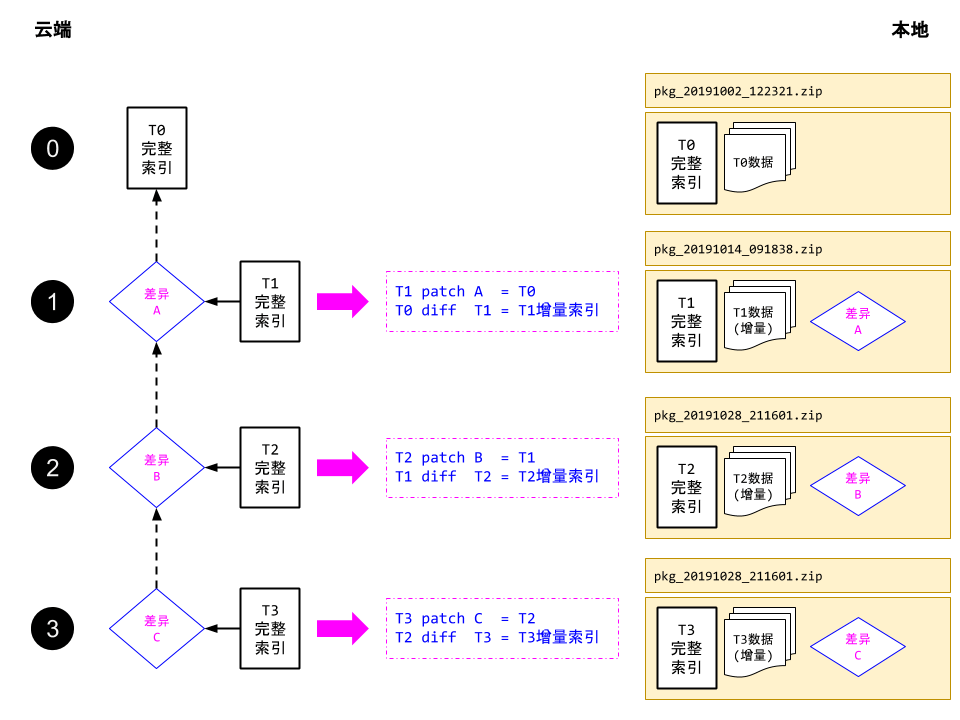
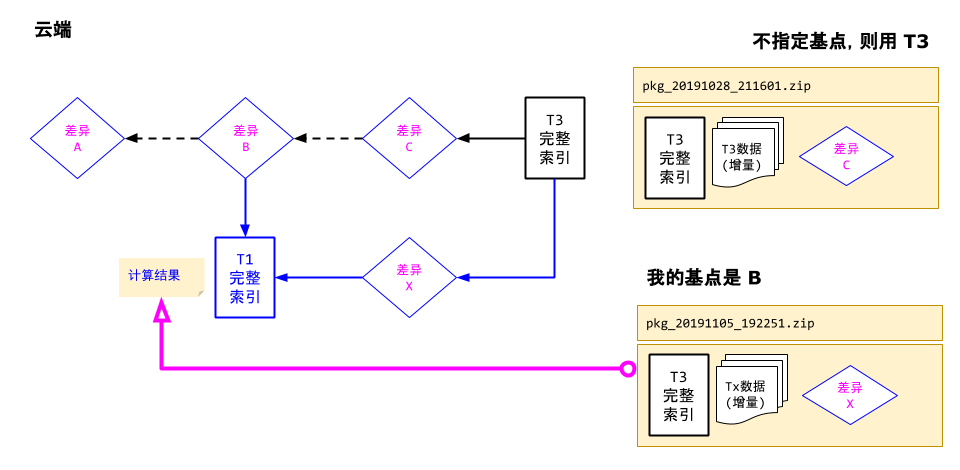

--------------------------------------------
# 整体概述

## 备份的生成



## 备份的下载



------------------------------------------
# 还原设定

## 增删级别

> `BulkRLTree`

Lv. |`BSR`|`BDR`|`PKG`|`TREE`
----|-----|-----|-----|-------
Tree1  | `R` | `I` | `A` | `I`
Tree2  | `R` | `R` | `A` | `I`
Tree3  | `R` | `R` | `A` | `D`

- 节点还原时遇到的情况
  - `BSR`  :  Both and in same Race
  - `BDR`  : Both but differance Race
  - `PKG`  : Package Only
  - `TREE` : Tree Only
- 节点还原时可执行的操作策略
  - `R` : Replace
  - `I` : Ignore
  - `D` : Delete
  - `A` : Add

## 修改级别

> `BulkRLObj`

Lv. |`path` | `oid` |`rid` |`biz` |`mod` |`ln`
----|------|------|-----|-----|-----|----
Obj1  | `rl`  | `nw`  | `tr` | `ig` | `ig` |`ig`
Obj2  | `rl`  | `nw`  | `tr` | `cp` | `ig` |`tr`
Obj3  | `rl`  | `nw`  | `tr` | `cp` | `cp` |`tr`
Obj4  | `cp`  | `cp`  | `cp` | `cp` | `cp` |`cp`

- `path` : WnObj absoulte full path
- `oid`  : WnObj ID
- `rid`  : Refer to WnObj ID in file content
- `biz`  : WnObj business meta data
- `mod`  : WnObj `mode` code in meta data
- `rl` : Change the path relative to new target
- `nw` : Generated new value
- `tr` : Translate it to new value
- `ig` : Ignore it
- `cp` : Copy it

--------------------------------------------
# 数据结构

## 服务器域结构

```bash
~/path/to/dir/
  |-- .bulk/             # 当前目录的备份设置
      |-- ignores.json   # 忽略列表
      |-- history.wnsi   # 历次备份历史
      |-- data/
      |   |-- 9u/79..65  # 文件内容的 SHA1
      |-- tree/          # 存放完整索引内容
      |   |-- 4a9..23d.wns_tree   # 文件名为一个这个tree内容的 SHA1 值
      |-- patch/         # 存放差异内容
          |-- ta3..9rq.wns_patch  # 文件名为一个这个diff内容的 SHA1 值
```

## ignores.json

```js
{ 
  // 黑名单目录路径，匹配上就忽略
  // 要求这些路径不能互相嵌套，否则执行备份时会抛错
  // 默认为空
  // 黑名单会在白名单递归时生效
  // $ 开头为正则
  ignorePaths : ["path/to/dir1","^REGEX$"],

  // 是否忽略隐藏，默认 true
  ignoreHidden : true,

  // 是否忽略临时文件, 默认 true
  // 所谓临时文件就是 expi 大于 0 的文件或者目录
  ignoreExpi : true,

  // 忽略缩略图的缓存
  ignoreThumbnail : true,

  // 构建元数据JSON时要忽略的键，默认如下：
  ignoreMetaKeys : "^(id|c|m|g|d0|d1|pid|nm|ct|lm|expi)$",

  // 还原时，自动修改元数据的 ID 映射
  restoreMappingIds : true,

  // 针对文件：只有这些文件类型才会被考虑
  // 其中 `""` 空串表示无后缀文件
  // $ 开头为正则
  whiteTypes : ["avi","mp4","json",""],

  // 针对文件：这些文件类型将不会被考虑。
  // 无论是否被白名单命中，黑名单命中后一定会忽略的
  // 其中 `""` 空串表示无后缀文件
  // $ 开头为正则
  blackTypes : ["avi","mp4","json","", "^REGEX$"]

  // 针对文件：对于 MIME 类型的限制
  whiteMimes : ["text/plain", "$REGEX$"],
  blackMimes : ["text/plain", "$REGEX$"],
}
```
## History:备份历史

```bash
2019-10-13T23:45:12.801=7a9..23d.wns_patch  # 首次提交
2019-10-14T23:41:14.002=4g2..53f.wns_patch  # 差异
2019-10-15T23:42:22.653=ej4..631.wns_patch  # 差异
2019-10-19T23:47:19.541=m4k..a2a.wns_tree   # 最后一次完整索引
```

## Tree:完整索引

```bash
# 首行表示是差异(PATCH)或者索引(INDEX)
# 冒号后表示前序差异或索引的文件名
# 次行表示生成本文件的时间戳
INDEX:4a9..23d.wns_patch
2019-10-21T23:14:56.002+8   

# 连续两个空行表示正文
meta:F:~/path/to/a=SHA1(4t6..a37)   # 文件元数据
data:F:~/path/to/a=SHA1(93d..5ew)   # 文件裸数据，空文件则没有这个记录
meta:D:~/path/to/b=SHA1(87t..bnq)   # 目录元数据
```

## Patch:差异

```bash
# 首行表示是差异(PATCH)或者索引(INDEX)
# 冒号后表示前序差异或索引的文件名
# 次行表示生成本文件的时间戳
PATCH:df2..76s.wns_index
2019-10-21T23:14:56.002+8

# 连续两个空行表示正文
-meta:F:~/path/to/a=SHA1(4t6..a37)  # 减号 `-` 表示要删除
-data:F:~/path/to/a=SHA1(93d..5ew)  # 通常meta删了，data也要删
+meta:F:~/path/to/x=SHA1(93d..5ew)  # 加号 `+` 表示要新增
=meta:D:~/path/to/b=SHA1(87t..bnq)  # 等号 `=` 表示要修改
>meta:F:~/path/to/y=SHA1(87t..bnq)  # 大于号`>` 表示要移动
```

> 这里需要考虑到 meta/data 都是减号，但是同款SHA1 在后续出现
> `meta/data` 的加号，则表示移动
> 也就是说。如果文件改名，有改动内容或者元数据的话，相当于删掉再增
> 否则仅仅是改名的话，可以当作移动

## Pkg:备份包

```bash
pkg_20191002_122331.zip
|-- pkg/    # 包信息，还原时首先上传
|   |-- pkg_info.json       # 包的信息
|   |-- 4a9..23d.wns_index  # 完整索引
|   |-- df2..76s.wns_patch  # 基点差异
|-- meta/     # 所有的元数据
|   |-- 67r..23e    # 文件名是SHA1
|-- data/     # 所有的裸数据
    |-- 93d..5ew    # 文件名是SHA1
```

其中 `pkg_info.json` 格式为：

```js
{
  index : "4a9..23d",    // 索引名（无后缀表SHA1）
  patch : "df2..76s",    // 差异名（无后缀表SHA1）
  create : "2019-10-21T23:14:56.002+8", // 服务器生成时间戳
  domain : "demo",      // 云端域名
  server : "site0.cn",  // 服务器地址
  port   : 80,          // 服务器端口
  indexCount : 9822,    // 索引条目数
  patchCount : 342,     // 差异条目数
  metaCount  : 342,     // 元数据数量
  dataCount  : 543,     // 裸数据数量
}
```

--------------------------------------------
# 备份与还原

- 默认使用上一次的备份结果作为基点
- 基点名为完整索引的SHA1
- 如果指定一个基点，则服务器根据基点创建新的差异



--------------------------------------------
# 关键算法

## Scan:根据完整索引扫描变动

> 计算变动索引

## Diff:计算差异

> 两个序列
> 三个Hash表，得到新增，删除，修改三个序列
> 合并三个 Hash 表

## Patch:应用差异

## Roll:回滚差异

## 还原时的 ID 映射

--------------------------------------------
# 使用场景

## 场景：两个 Walnut 好朋友

- 要可以从site0域A 到 local域A
- 要可以从local域A 到 site0域A  

```bash
local -> site0::  我现在的索引
           <- 差异索引 A。  ID
local -> forEach (A) 
          -> 请求需要多少个资源
          -> 服务器和本地都缓存同样的差异表
          -> 按顺序获取，由本地发起，指明服务器序号
          -> 可以一次获取多个，传一个区间 [318~921) 前闭后开
```

## 场景：浏览器和云端备份(完整)

```bash
浏览器 -> 云:: 我要备份
      下载保存 <- 完整索引
浏览器 -> 云:: 我要数据(完整索引的ID)
      下载保存 <- 数据的压缩包

>>> 还原
浏览器 -> 云:: 我要还原（完整索引）
       <- 一个文件名列表（元数据和裸数据）
浏览器 -> 用户:: 请选择备份数据目录
      <- 给一个备份目录
浏览器 -> 云:: 根据文件名判断是否要真的上传
      差异表里有的才传
```

## 场景：浏览器和云端备份(增量)

```bash
浏览器 -> 云:: 我要备份(上一次的索引)
      下载保存 <- 完整索引 + 差异索引
浏览器 -> 云:: 我要数据(差异索引ID)
      下载保存 <- 数据的压缩包

>>> 还原
浏览器 -> 云:: 我要还原（完整索引）
       <- 一个文件名列表（元数据和裸数据）
浏览器 -> 用户:: 请选择备份数据目录
      <- 给一个备份目录
浏览器 -> 云:: 根据文件名判断是否要真的上传
      差异表里有的才传
浏览器 -> 自行判断是否都传完了没？
      <- 如果没有，再要求用户选择另一个数据目录
```

--------------------------------------------
# 四种操作定义

```bash
#---------------------------
# 定义四种操作
- Scan   # 扫描变动
- Diff   # 计算差异
- Patch  # 应用差异
- Roll   # 回滚差异
#---------------------------
# 差异等价律
If
  [A] Diff  [B] = [x]
Then
  [A] Patch [x] = [B]
#---------------------------
# 回滚等价律
If
  [A] Diff [B] = [x]
Then
  [B] Roll [x] = [A]
#---------------------------
# 差异单向律
[A] Diff  [B] != [B] Diff  [A]
[B] Patch [C] != [C] Patch [B]
[A] Roll  [x] != [A] Patch [x]
[x] Roll  [A] == Forbidden
```

--------------------------------------------
# 算法参考

- https://github.com/google/diff-match-patch