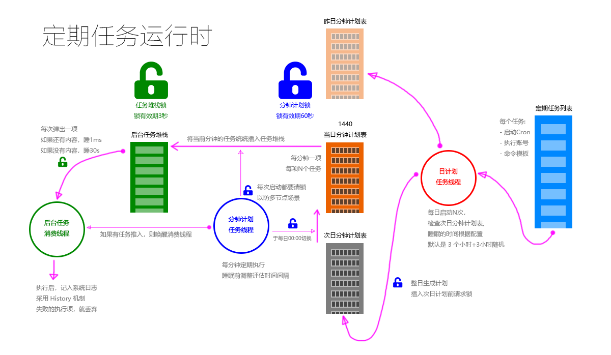

------------------------------------------
# 动机：为什么要有定期任务

`Walnut` 设计的场景是多节点（甚至是海量节点）与海量数据与海量用户。
每个用户都有可能建立多个定期任务。

因此，系统的定期任务执行是一个问题。你不可能随时扫描每个用户的定期列表。
为此我们需要一个机制，利用每个节点的计算资源，分布式的执行任务。

--------------------------------------
# 设计思路与边界

考虑到效率问题，我们将定期任务的精度降低到1分钟。如果是秒级，每天需要用`86400`个记录描述。
而降低到分钟，每天则只需要`1440`个记录描述。

这`1440`个记录，我们称为`分钟槽`，每个`分钟槽`里面存放多条可执行的任务。
这样，我们的定期计划执行线程，只需要每分钟启动一次，将`分钟槽`里的任务，统统插入`后台任务堆栈`
即可。

我们提到了`后台任务堆栈`，这个堆栈可以是一个长长的列表，每个节点都有一个`任务堆栈消费线程`，
它们的目的就是每次启动，都消费一个堆栈项，只有堆栈为空，线程才会休息一会儿。否则会尽快处理下一项。



考虑到跨越多节点的线程安全，我们还需要两个锁，

- `分钟计划锁`： `读/写`分钟计划时需要的锁
- `任务堆栈锁`： `弹出`任务堆栈时需要的锁

考虑到效率，再向`任务堆栈`插入任务时，分钟计划线程并不需要`任务堆栈锁`，
因为这是一个纯插入的操作，肯定是线程安全的。

从实现的角度来说，两个锁，默认是选择 `RedisLockApi`。

三个表，实际上就是系统目录下的文件，这样，如果考虑到效率，可以通过 IO 层映射到更快的媒体

Name       | Path             | Title
-----------|------------------|---------------------
`cron`     | `/sys/cron/`     | `定期任务表`
`schedule` | `/sys/schedule/` | `分钟计划表`
`task`     | `/sys/tasks/`    | `后台任务堆栈`

--------------------------------------
# 数据结构

## 定期任务

> 存放在`定期任务表`里的文件对象

```bash
#-------------------------------------
#
# 元数据部分
#
#-------------------------------------
id: ID          # 定期任务的唯一 ID
nm: UUID        # 默认是与 ID 相同的 UUID32
tp: 'cron_task' # 类型一定是 `cron_task`，否则会被无视
#
# 定期运行时间点
# > 这个参看 WnCron 的语法介绍
#
cron : "0 0 0 * * ? " # 一个 ZCron 表达式
#
# 关于任务执行的权限
#
user : "zozoh"  # 用哪个系统账号执行
#
# 所有者
#
c : "root"    # 任务均由根用户创建
g : "root"    # 系统任务一定是输入根组
#-------------------------------------
#
# 文件内容部分
# 就是一个命令模板
#
#-------------------------------------
cat ~/abc.txt > ~/myoutput
```

## 分钟计划任务

> 存放在`分钟计划表`里的文件对象

```bash
#-------------------------------------
#
# 元数据部分
#
#-------------------------------------
id: ID                # 重新分配的计划任务的唯一 ID
nm: '20210913-0003-${NM}' # 其中 NM 就是定期任务列表里的 nm 字段
tp: 'schedule_task'   # 类型一定是 `schedule_task`，否则会被无视
#
# 定期运行时间点（仅仅用来查看）
# > 这个参看 WnCron 的语法介绍
#
cron : "0 0 0 * * ? " # 一个 ZCron 表达式
date : "20210913"     # 任务所属日期
slot : 3              # 分钟槽下标（0Base）0-1439
#
# 关于任务执行的权限
#
user : "zozoh"  # 用哪个系统账号执行
#
# 自动清理
#
expi : AMS      # 指定一个过期绝对毫秒数，以便清理线程清理数据
#
# 所有者
#
c : "root"    # 任务均由根用户创建
g : "root"    # 系统任务一定是输入根组
#-------------------------------------
#
# 文件内容部分
# 就是一个命令模板
#
#-------------------------------------
cat ~/abc.txt > ~/myoutput
```

## 分钟计划索引文件

为了不重复生成分钟计划，在`/sys/schedule/index/`目录下会由下面的结构

```bash
/sys/schedule/index/
|-- 20210912.schedule.index.txt   # 占位索引文件
|-- ...
```

一旦一天的这个文件生成了，以后的日计划任务线程就不会再次生成这个文件了，
文件的内容就是一个分钟计划的列表：

```bash
20210913-0003-ea23..89a1:zozoh
...
```

## 后台任务项

```bash
#-------------------------------------
#
# 元数据部分
#
#-------------------------------------
id: ID                    # 重新分配的任务的唯一 ID
nm: '20210913-0003-xxx'   # 分钟计划列表里的 nm 字段，这样便不会重复插入
tp: 'sys_task'            # 类型一定是 `sys_task`，否则会被无视
#
# 定期运行时间点（仅仅用来查看）
# > 这个参看 WnCron 的语法介绍
#
cron : "0 0 0 * * ? " # 一个 ZCron 表达式
date : "20210913"     # 任务所属日期
slot : 3              # 分钟槽下标（0Base）0-1439
#
# 关于任务执行的权限
#
user : "zozoh"  # 用哪个系统账号执行
#
# 所有者
#
c : "root"    # 任务均由根用户创建
g : "root"    # 系统任务一定是输入根组
#-------------------------------------
#
# 文件内容部分
# 就是一个命令模板
#
#-------------------------------------
cat ~/abc.txt > ~/myoutput
```

--------------------------------------
# 操作命令

系统提供了三个命令来管理定期任务逻辑:

- `cron` 管理定期任务列表
- `schedule` 管理分钟计划表
- `task` 管理任务堆栈

## cmd_cron

```bash
cron list        # 列出所有的定期任务（非root组成员仅能看自己的任务）
cron add         # 添加一个定期任务
cron remove      # 删除一个定期任务
cron preview     # 预览指定定期任务的计划表
```

## cmd_schedule

```bash
schedule list        # 列出所有的分钟计划任务（非root组成员仅能看自己的任务）
schedule load        # 将定期任务表的任务加载分钟计划表（需指定一个日期）
schedule clean       # 主动清除过期的分钟计划
```

## cmd_task

```bash
task list            # 列出堆栈里的所有任务
task run             # 主动堆栈里的一个或者多个任务
task clear           # 清空任务堆栈
task remove          # 删除任务堆栈中的一条或者多条任务
```