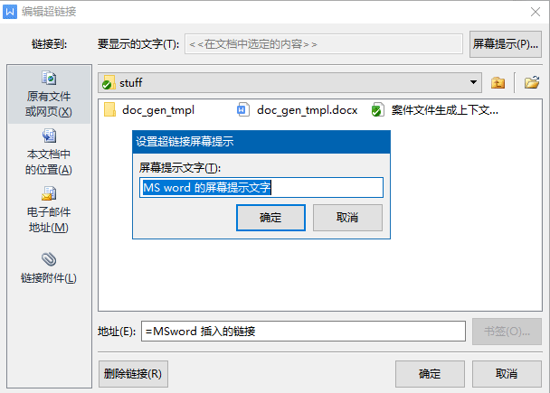

# 设计目标

> 用户通过`wps`或者`word`直接编辑文档模板

1. 支持文字占位符
2. 支持图片
3. 支持循环
4. 支持分支
5. 支持循环与分支的无限嵌套
6. 占位符尽量不要破坏原本的布局

# 相关背景

一个 word 文档， 主体(`document.xml`里面的`<w:body>`)下面基本结构为：

```bash
<w:document>
|-- <w:body>
    #
    # 段落的基本结构
    #
    |-- <w:p>
    |   |-- <w:pPr>
    |   # 普通文字
    |   |-- <w:r>
    |   |   |-- <w:rPr>
    |   |   |-- <w:t>xxx</w:t>
    |   # 一个 Wingdings 的图形字符
    |   |-- <w:r>
    |   |   |-- <w:rPr>
    |   |   |-- <w:sym w:font="Wingdings 2" w:char="0052"/>
    |   # 一个超链接
    |   |-- <w:r>
    |   |   |-- <w:fldChar w:fldCharType="begin">
    |   |-- <w:r>
    |   |   |-- <w:rPr>
    |   |   |-- <w:instrText>
    |   |   |   # 相当于: HYPERLINK "link" \o "tip text" 
    |   |   |   #  - link 就是链接内容
    |   |   |   #  - tip text 是屏幕提示文字
    |   |   |   |-- HYPERLINK &quot;link&quot; \o &quot;tip text&quot; 
    |   |-- <w:r>
    |   |   |-- <w:rPr>
    |   |   |-- <w:fldChar w:fldCharType="separate">
    |   |-- <w:r>
    |   |   |-- <w:rPr>
    |   |   |-- <w:t>链接文字</w:t>
    |   |-- <w:r>
    |   |   |-- <w:rPr>
    |   |   |-- <w:fldChar w:fldCharType="end">
    #
    # 表格的基本结构
    #
    |   <w:tbl>
    |   |-- <w:tblPr>
    |   |-- <w:tblGrid>
    |   |-- <w:tr>
    |   |   |-- <w:tc>
    |   |   |   |-- <w:tcPr>
    |   |   |   |-- <w:p>
    |   |   |   |   |-- <w:pPr>
    |   |   |   |   |-- <w:r>
    |   |   |   |   |   |-- <w:rPr>
    |   |   |   |   |   |-- <w:t>
    #
    # 图片必须在段落里
    #
    |-- <w:p>
    |   |-- <w:pPr>
    |   |-- <w:r>
    |   |   |-- <w:rPr>
    |   |   |-- <w:drawing>
    |   |   |   |-- <wp:inline>
    |   |   |   |   |-- <wp:extent>
    |   |   |   |   |-- <wp:effectExtent>
    |   |   |   |   |-- <wp:docPr>
    |   |   |   |   |   |-- <a:hlinkClick r:id="rId4" tooltip="xxxx">
    |   |   |   |   |-- <wp:cNvGraphicFramePr>
    |   |   |   |   |   |-- <a:graphicFrameLocks>
    |   |   |   |   |-- <a:graphic>
    |   |   |   |   |   |-- <a:graphicData>
    |   |   |   |   |   |   |-- <pic:pic>
    |   |   |   |   |   |   |   |-- <pic:nvPicPr>
    |   |   |   |   |   |   |   |-- <pic:blipFill>
    |   |   |   |   |   |   |   |   |-- <a:blip r:embed="rId5">
    |   |   |   |   |   |   |   |   |-- <a:stretch>
    |   |   |   |   |   |   |   |   |   |-- <a:fillRect>
    |   |   |   |   |   |   |   |-- <pic:spPr>
    |   |   |   |   |   |   |   |   |-- <a:xfrm>
    |   |   |   |   |   |   |   |   |   |-- <a:off>
    |   |   |   |   |   |   |   |   |   |-- <a:ext>
    |   |   |   |   |   |   |   |   |-- <a:prstGeom>
    |   |   |   |   |   |   |   |   |   |-- <a:avLst>
    #
    # 文档的属性
    #
    |-- <w:sectPr>
    |   |-- <w:type>
    |   |-- <w:pgSz>
    |   |-- <w:pgMar>
    |   |-- <w:cols>
    |   |-- <w:docGrid>
```

# 解决思路

我们读取这样的 `word` 文档作为模板，然后根据一个上下文变量集合，
将变量的值填入对应的模板占位符里。对于循环和判断也依照上下文进行循环复制或者选择性输出。

# 占位符

我们需要下面几种占位符:

1. 字面量
   - 普通文本: `NORMAL`
   - 分支: `IF / ELSE_IF / ELSE`
   - 循环: `LOOP`
   - 结束: `END` *用来结束循环和分支*
2. 图片: `PIC`
3. 超链接: `HYPER`

下面我们详细说明这几种占位符在 `xml` 的节点特征

## 字面量

**节点特征**

```bash
<w:p>
|-- <w:pPr>
|-- <w:r>
|   |-- <w:rPr>
|   |-- <w:t>随便的其他文字</w:t>
|-- <w:r>
|   |-- <w:rPr>
|   |-- <w:t>$</w:t>
|-- <w:r>
|   |-- <w:rPr>
|   |-- <w:t>{</w:t>
|-- <w:r>
|   |-- <w:rPr>
|   |-- <w:t>a?未知</w:t>
|-- <w:r>
|   |-- <w:rPr>
|   |-- <w:t>}</w:t>
|-- <w:r>
|   |-- <w:rPr>
|   |-- <w:t>跟随的文字</w:t>
```

**占位符语法**

```bash
#
# 普通占位符
#
${a?默认值}     # 遵循 Nutz.Tmpl 语法
#
# 循环开始
#  - it : 循环内会将迭代元素计入这个名称的上下文变量
#  - list : 上下文变量。预期是一个可迭代的列表或者数组
#
#{loop @ it : list}
#
# 分支开始
# - some : 上下文变量。可以是字符串或者数字以及布尔
# - yes  : 一个字符串表达式，符合 AutoMatch 的规定
#
#{if @ some: yes}
#
# 分支继续
# - name : 上下文变量。可以是字符串或者数字以及布尔
# - 它将继续加入 #if 开创的分支
#
#{else-if @ name: ^a}
#
# 分支默认
# - 它将继续加入 #if/#else-if 组成的分支
#
#{else}
#
# 结束标记
#  - 可以结束循环或者分支
#  - 这个设计可以避免循环分支的交叉嵌套
#
#{end}
```

## 图片

```bash
<w:p>
|-- <w:pPr>
|-- <w:r>
|   |-- <w:rPr>
|   |-- <w:drawing>
|   |   |-- <wp:inline>
|   |   |   |-- <wp:extent>
|   |   |   |-- <wp:effectExtent>
|   |   |   |-- <wp:docPr>
|   |   |   |   |-- <a:hlinkClick r:id="rId4" tooltip="xxxx">
|   |   |   |-- <wp:cNvGraphicFramePr>
|   |   |   |   |-- <a:graphicFrameLocks>
|   |   |   |-- <a:graphic>
|   |   |   |   |-- <a:graphicData>
|   |   |   |   |   |-- <pic:pic>
|   |   |   |   |   |   |-- <pic:nvPicPr>
|   |   |   |   |   |   |-- <pic:blipFill>
|   |   |   |   |   |   |   |-- <a:blip r:embed="rId5">
|   |   |   |   |   |   |   |-- <a:stretch>
|   |   |   |   |   |   |   |   |-- <a:fillRect>
|   |   |   |   |   |   |-- <pic:spPr>
|   |   |   |   |   |   |   |-- <a:xfrm>
|   |   |   |   |   |   |   |   |-- <a:off>
|   |   |   |   |   |   |   |   |-- <a:ext>
|   |   |   |   |   |   |   |-- <a:prstGeom>
|   |   |   |   |   |   |   |   |-- <a:avLst>
```

寻找 `w:drawing > wp:inline|wp:anchor > wp:docPr > a:hlinkClick` 从 `rId` 可以找到超链接。用户一般通过超链接面板设置：



超链接的文字内容为: `=thumb.id:ph` (如果是 `word` 插入，需要 URLDecode 一下)。

```bash
# 超链接内容: =thumb.id:id
thumb.id : 表示上下文变量
id : 表示变量是一个图片对象的 ID，默认为 "ph"
```

如果找到了这个特征，那么根据下面的:

```bash
w:drawing > wp:inline|wp:anchor > a:graphic > a:graphicData > pic:pic > pic:blipFill > a:blip@r:embed="rId5"
```

可以找到对应的图片文件，将其替换即可

## 超链接

通过一个超链接，从上下文中找到变量，进行二元判断，并判断应该输出哪个值。

```bash
<w:p>
|-- <w:pPr>
|-- <w:r>
|   |-- <w:fldChar w:fldCharType="begin">
|-- <w:r>
|   |-- <w:rPr>
|   |-- <w:instrText>
|   |   |-- HYPERLINK &quot;=age:[5,)&quot; \o &quot;√&quot; 
|-- <w:r>
|   |-- <w:rPr>
|   |-- <w:fldChar w:fldCharType="separate">
|-- <w:r>
|   |-- <w:rPr>
|   |-- <w:t>□</w:t>
|-- <w:r>
|   |-- <w:rPr>
|   |-- <w:fldChar w:fldCharType="end">
```

超链接文本解码后（还需要 URLDecode），应该是: `HYPERLINK "=age:[5,)" \o "√"`
它的意义如下：

```bash
age  : 上下文变量名
[5,) : 判断条件（AutoMatch）
"√"  : 如果条件为真，则将文字段替换
# 特殊字体文字
"sym(0052:Wingdings 2)
```

# 渲染树

```bash
# 段落
{ CopyNode }              # 复制 <w:p>
|-- { CopyNode }          # 复制 <w:pPr>
|   # 普通文字
|-- { CopyNode }          # 复制 <w:r>
|   |-- { CopyNode }      # 复制 <w:rPr>
|   |-- { CopyNode }      # 复制 <w:t>
|   |   |-- { CopyText }  # 复制 Text node
|   # 占位变量
|-- { Placeholder }       # 生成 <w:r>
|   # 二元输出
|-- { Hyper }             # 生成或复制 <w:r>
|                         # 可能输出 <w:t>
|                         # 也可能输出 <w:sym>
|   # 图片
|-- { CopyNode }          # 复制 <w:r>
|   |-- { CopyNode }      # 复制 <w:rPr>
|   |-- { Picture }       # 生成 <w:drawing>
# 列表/子列表
{ Loop }
|-- { CopyNode }          # 生成 <w:p>
|   |-- { CopyNode }      # 复制 <w:pPr>
|   |-- { CopyNode }      # 复制 <w:r>
|   |-- { Placeholder }   # 生成 <w:r>
|   |-- { CopyNode }      # 复制 <w:r>
|-- { Loop }
|   |-- { CopyNode }          # 生成 <w:p>
|   |   |-- { CopyNode }      # 复制 <w:pPr>
|   |   |-- { CopyNode }      # 复制 <w:r>
|   |   |-- { Placeholder }   # 生成 <w:r>
|   |   |-- { CopyNode }      # 复制 <w:r>
# 表格 (块单位，为行 <w:tr>)
{ CopyNode }              # 复制 <w:tbl>
|-- { CopyNode }          # 复制 <w:tblPr>
|-- { CopyNode }          # 复制 <w:tblGrid>
|-- { Loop }
|   |-- { CopyNode }      # 复制 <w:tr>
|   |   |-- { CopyNode }      # 复制 <w:tc>
|   |   |   |-- { CopyNode }  # 复制 <w:tcPr>
|   |   |   |-- { CopyNode }  # 复制 <w:p>
|   |   |   |   |-- { CopyNode }     # 复制 <w:pPr>
|   |   |   |   |-- { Placeholder }  # 生成 <w:r>
|   |   |-- { CopyNode }      # 复制 <w:tc>
|   |   |   |-- <..重复单元格..>
|   |-- { Branch }            # 在循环里也支持判断
# 分支输出
{ Branch }
|-- { Condition }
|   |-- { CopyNode }      # 复制 <w:p>
|   |   |-- { CopyNode }  # 复制 <w:pPr>
|   |   |-- <..与段落一致..>
|-- { Condition }
|   |-- <..另外一个分支..>
|-- { Condition = true }
|   |-- <..默认分支..>

```

# 解析算法

```bash
# 判断 <w:p> | <w:tr> 是否为循环或者分支的开头
# 如果是，则开启一个对应的渲染节点，并递归

# 非 <w:p> 节点，直接生成 CopyNode

# 如果是一个 <w:p> 则开启分析栈
Buffer : "${a?text} good weather"
          |<--+-->|
              | 每次压栈，匹配一下缓冲，如果找到占位符，记录并清栈
              | 如果遇到了 </w:p> 也清栈
              | 我们笃定，Buffer 里不会连续出现两个占位符的
              | 因为 word/wps 总会将字符拆到不同的 <w:r> 里
      Top
    [<w:r>]   <-| Picture 或者 Hyper 的特征也导致清栈
    [<w:r>]     | Hyper 则开启后续查找模式，收集 Hyper 的全部信息
    [<w:r>]     | Picture 则分析内部的 w:drawing
    [<w:r>]
1:  [<w:r>]
^    Bottom
|
+--- Bottom run 的 <w:t> 文字偏移(0Base)
```