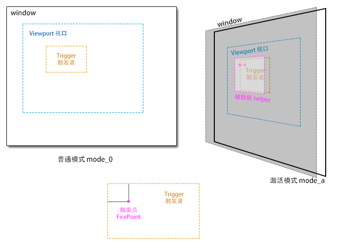

---
title:$().pmoving - 指针移动上下文
author:zozoh
---

# 设计意图

* 希望触控设备和桌面鼠标设备采用同样的方法来处理下面这些交互行文
    - 移动
    - 拖拽
    - 改变大小
    - 其他收拾
* 本方法给出了一个底层实现的基础
* 本方法是一个 jQuery 插件

# 实现原理



* `trigger` : 触发移动的元素
* `viewport` : 移动的范围
    - jQuery | DOM 根据一个元素限定移动范围
    - Rect 指定一个绝对的移动范围
    - null 整个窗体为移动范围
* `FirePoint` : 触发点，记录相对于触发者的位置
* `helper` : 辅助框，用来让回调绘制附加一些移动时信息

# 触发逻辑

```
// 下面的逻辑，位置采用窗口坐标系，即 y 越大，越靠近底部
// opt 表示 PointerMoving 的配置信息
监控 mousedown (trigger){
    //.........................................
    创建上下文 pmvContext = {
        $trigger,
        $viewport,
        startInMs,
        atX,
        atY,
        beginX,
        beginY,
    }
    //.........................................
    设置一个全局遮罩层
    pmvContext += {
        $mask,
        $helper,
    }
    监听遮罩层 {
        mouseup(mask) {
            pmvContext += {
                endInMs,
                X,
                Y,
            }
            如果 trigger.pmv_mode_a 表示在激活模式 {
                利用 opt.position 修正 X 和 Y
                根据 opt.mode 限制 X 和 Y
                根据 opt.boundery 计算 trigger 的位置 {
                    这里要考虑 trigger 不能超过 viewport
                }
                根据 opt.autoUpdateTriggerBy 更新 trigger 位置
                opt.on_end(pvmContext);
                移除 trigger.pmv_mode_a 标识
                移除遮罩和辅助框
            }
            否则如果在 opt.clickRadius 内释放 {
                trigger.click();
            }
        }
        mousemove(mask) {
            pmvContext += {
                X,
                Y,
            }
            如果 trigger.pmv_mode_a 表示在激活模式 {
                利用 opt.position 修正 X 和 Y
                根据 opt.mode 限制 X 和 Y
                根据 opt.boundery 计算 trigger 的位置
                    这里要考虑 trigger 不能超过 viewport
                }
                根据 opt.autoUpdateTriggerBy 更新 trigger 位置
                opt.on_ing(pvmContext);
                修改辅助框位置，使其完全覆盖 trigger
                opt.on_update(pvmContext);
            }               
        }
    }
    //.........................................
    设置延迟函数(opt.delay) {
        如果没有 pvmContext.endInMs 表示要进入激活态 {
            标识 trigger.pmv_mode_a = "yes"
            修改辅助框位置，使其完全覆盖 trigger          
            opt.on_begin(pvmContext)
            opt.on_update(pvmContext);
        }
    }
}

```

# 运行时上下文

```
{
    Event     : Event,    // 事件对象
    $context  : jQuery,   // 绑定了 pmoving 的对象，默认也作为视口
    $trigger  : jQuery,   // 触发者 DOM
    $viewport : jQuery,   // 视口 DOM
    $mask     : jQuery,   // 遮罩层 DOM
    $scroll   : jQuery,   // 视口响应滚动的 DOM，默认为 $viewport
                          // 如果 BODY 为视口，则为 document
    $drops    : jQuery,   // 遮罩层内拖拽目标辅助层 DOM
    dropping  : [{        // 拖拽目标信息
        rect   : Rect     // 目标矩形的绝对位置
        $ele   : jQuery   // 原始目标对象
        helper : jQuery   // 辅助对象
    }],
    $helper   : jQuery,   // 遮罩层内辅助块 DOM
    options   : {..},     // 配置信息对象
    data      : null,     // 调用者自定义的数据对象
    startInMs : MS,       // 开始时间
    endInMs   : MS,       // 结束时间
    posAt     : {x, y},   // 初始点击相对于 viewport
    posBegin  : {x, y},   // 初始点击全局
    x      : Number,      // 当前指针全局水平位置
    y      : Number,      // 当前指针全局垂直位置
    // 根据上一次位置，计算本次移动的移动距离
    // 负数表示向左（上），正数表示向右（下），0 表示没有改变
    move : {
       x : 0,    // X 轴位移
       y : 0     // Y 轴位移
    },
    // 下面是一组位置信息，控件自动实时计算，回调们就取个数就成了
    rect : {
        viewport : Rect,      // 视口绝对位置
        origin   : Rect,      // 触发者原始绝对位置
        originInView : Rect,  // 触发者原始的相对(视口)位置
        trigger  : Rect,      // 触发者绝对位置
        boundary : Rect,      // 触发者边界的绝对位置
        inview   : Rect,      // 触发者相对(视口)位置
                              // !!! 不要改它，它是只读的，改了也没用
                              // !!! 是控件自动改的
        helper   : Rect,      // 去除掉视口滚动后，帮助对象的绝对位置
    }
}
```

# 矩形计算

zutil.js 提供下面的函数来辅助矩形计算

```
// 根据 top,left,width,height 计算剩下的信息
$z.rect_count_tlwh(rect);

// 根据 top,left,bottom,right 计算剩下的信息
$z.rect_count_tlbr(rect);

// 根据 bottom,right,width,height 计算剩下的信息
$z.rect_count_brwh(rect);

// 根据 x,y,width,height 计算剩下的信息
$z.rect_count_xywh(rect);

// 得到一个新 Rect 坐标系相对于 base
$z.rect_relative(rect, base);

// 计算相交
$z.rect_overlap(rectA, rectB);

// 相交面积
$z.rect_overlap_area(rectA, rectB);

// A 是否全部包含 B
$z.rect_contains(rectA, rectB)

// A 是否与 B 相交
$z.rect_is_overlap(rectA, rectB)

// 生成一个新的矩形
// 用 B 限制 A，会保证 A 完全在 B 中，且距离原来的位置最近
$z.rect_clip_boundary(rectA, rectB);

// 修改 A ，将其中点移动到某个位置
// 第二个参数对象只要有 x,y 就好了，因此也可以是另外一个 Rect
$z.rect_move_xy(rect, {x,y});

// 修改 ，将其左上顶点移动到某个位置
// 第二个参数对象只要有 x,y 就好了，因此也可以是另外一个 Rect
// offset 表示一个偏移量，可选。通用用来计算移动时，鼠标与左上顶点的偏移
$z.rect_move_tl(rect, {x,y}, offset:{x,y});
```

# Rect 结构

```
// 在 zutil.js 的 rect 函数里定义了 Rect 对象
{
   width  : Number,
   height : Number,
   top    : Number,
   left   : Number,
   right  : Number,
   bottom : Number,
   x      : Number,    // 中点横坐标
   y      : Number,    // 中点纵坐标
}
```

# 遮罩层的结构

```
<div class="pmv-mask">
    <!--
    「选」 绘制放置的目标，每个子元素都对应要放置的目标
    可以用 css  .pmv-dropi[pmv-hover] 来修改鼠标进入时的显示模式
    -->
    <div class="pmv-drops">
        <div class="pmv-dropi" pmv-hover="yes"></div>
        <div class="pmv-dropi"></div>
    </div>
    <div class="pmv-helper"><!--// 来自用户的自定义--></div>
</div>
```

# 如何创建

```
$(ele).pmoving({
    // 在 viewport 之内，的选择器，会被应用
    // $(viewport).on("mousedown", trigger, F())
    // 默认，会是 ">*"
    trigger  : "selector",
    
    // 因为考虑到 viewport 可能是动态生成的, 根据 triger 的元素找到对应的 viewport
    // 默认，会认为是 $(ele) 自身
    // 函数第一个参数将是绑定 pmoving 的 jQuery 对象
    // 第二个参数为事件对象
    // 如果函数返回 null 或者一个空 jQuery 集合，那么表示禁止触发
    findViewport : {jTrigger}F($context, e):jViewport,
    
    // 有可能是 trigger 选择器内部某个元素（比如修改大小的手柄）被作为触发对象
    // 可以通过一个自定义函数，返回你确定要移动的元素。
    // 默认的，会认为整个 trigger 元素就是要移动的对象
    // 如果函数返回 null 或者一个空 jQuery 集合，那么表示禁止触发
    findTrigger : {Element}F(e):jTrigger
    
    // 如果移动的时候支持 Drag&Drop 模式，这个选项给出了哪些是 drop 的目标
    // 对应 drop 的目标，会在 mask 上绘制出单独的一层，辅助显示
    // 如果传入的参数是一个字符串，那么认为是一个全局选择器，从文档上选择对应的元素
    // 当然也可是是一个 jQuery 对象或者的 DOM 对象，只要能被 $(xxx) 就好
    findDropTarget : selector | {pmvContext}F():jDropTarget
       
    // 在上下文中记录一个你自定义的对象，你可以直接从 pmvContext.data 获取你设置的值
    data : null,
    
    // 建立的遮罩层 z-index，默认为 999999
    maskZIndex : 999999,
    
    // 为 $mask 附加类选择器，默认 null 不加
    maskClass : null,
    
    // 移动的方式，默认 both
    //   x : 只能横向移动
    //   y : 只能纵向移动
    //   both : 两个方向都能移动
    mode : "x|y|both"
    
    // 自动修改 trigger 的位置时，采用哪个顶点
    // "top,left"      - 左上顶点
    // "top,right"     - 右上顶点
    // "bottom,left"   - 左下顶点
    // "bottom,right"  - 右下顶点
    //  null 表示不自动更新
    // 可以是数组模式，即 "top,left" 与 ["top","left"] 等价
    // 如果是拖拽模式，默认为 null
    // 否则默认为 "top,left"
    autoUpdateTriggerBy : "top,left"
    
    // 如何判断 trigger 超出了 viewport
    // undefined : 表示不限制
    // 0 : 根据中心点
    // "100%" or Float : 为 trigger 尺寸（不包括外边距）的倍数
    // INT : 为中心点开始的一个绝对大小的正方形（半径）
    boundary : 0 | Float | undefined
    
    // 表示按住多久才表示进入激活模式（mode_a）
    // 默认 100ms
    delay : MS
    
    // 如果释放的时候，没有进入激活模式，则有可能是对 trigger 的一次点击
    // 那么在原始点半径多少以内释放表示点击呢（单位像素）
    // 默认 3px
    clickRedius : 3
    
    // 修正trigger的位置，这里有两种方式，一种是假想视口布满了格子，移动要吸附上面
    // 第二种是一个高度定制的函数，用来直接修 pmvContext.rect.trigger
    // 的矩形形状
    position : {C}F(pmvContext) | {
        gridX  : 36 | .2 | "10%",    // 表示格子的宽度
        gridY  : 36 | .2 | "10%",    // 表示格子的高度
        stickX : 36 | .2 | "10%",    // 横向吸附半径
        stickY : 36 | .2 | "10%",    // 纵向吸附半径
        // 采用 trigger 的什么来进行计算 
        // - "dock"   根据边来吸附
        // - "center" 根据中点来吸附 
        by : "dock"
    }
    
    // 辅助框的位置，有下面几种形式
    //  {pmvContext}F():Rect - 自由计算，函数返回一个 rect (相对于viewport)
    // 默认的，会自行计算（会考虑到 ViewPort 的 scrollTop 等状态
    helperRect : {pmvContext}F():Rect,
    
    // 当移动超过边界的时候，是否自动滚动视口
    // 默认的，当不是 boundary 模式的时候为 true 否则为 false
    autoScrollViewport : true,
        
    /*
    移动相关回调函数
    */
    on_begin  : {pmvContext}F()  // 移动开始时
    on_ing    : {pmvContext}F()  // 移动时
    on_end    : {pmvContext}F()  // 移动结束时
    on_update : {pmvContext}F()  // 开始或移动结束时，主要用来更新 heper
    
    /*
    拖拽相关回调
    参数 ele 为目标的 jQuery 对象
    参数 helper 为拖动过程中绘制的辅助显示的 jQuery 对象 
    */
    on_dragenter : {pmvContext}F($ele,helper)  // 鼠标进入drop区域
    on_dragleave : {pmvContext}F($ele,helper)  // 鼠标离开 drop 的区域
    on_drop      : {pmvContext}F($ele)  // 当丢下一个对象的回调
});
``` 


# 如何销毁

```
$(context).pmoving("destroy");
```

* 销毁会删除在宿主上的事件监听

